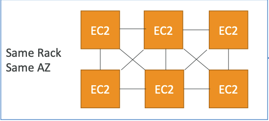
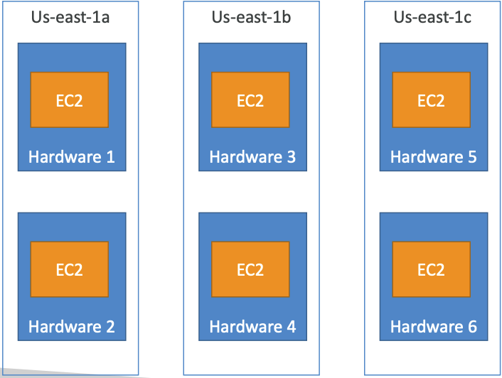
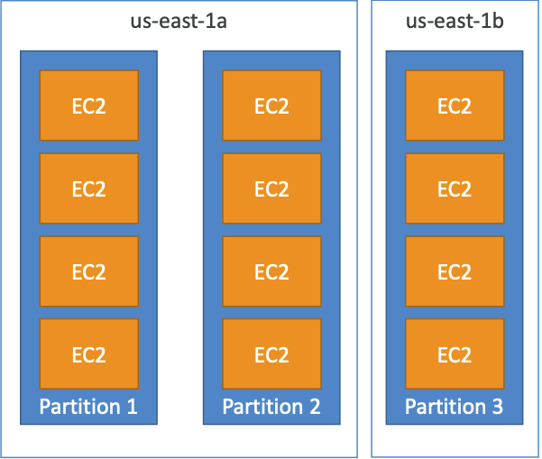
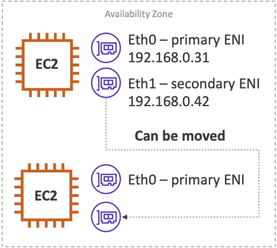
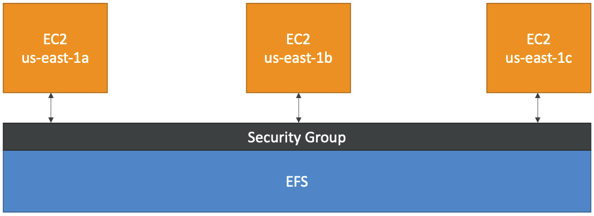
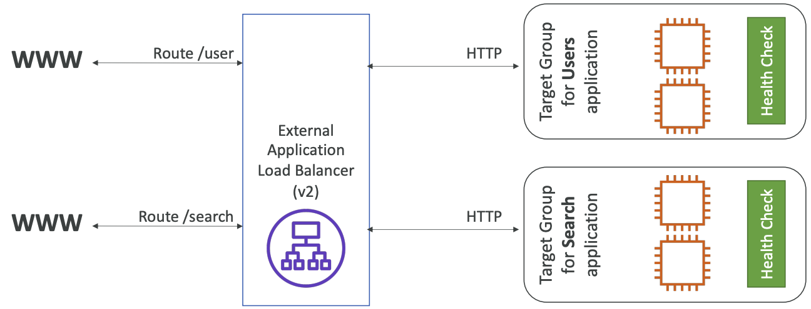
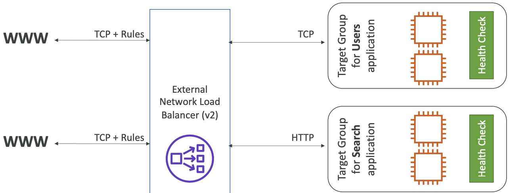
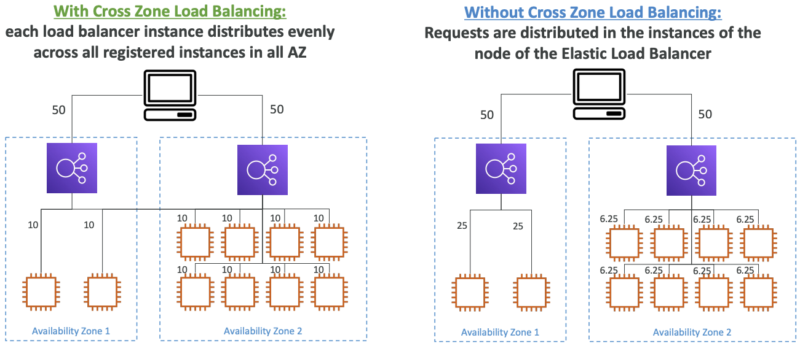
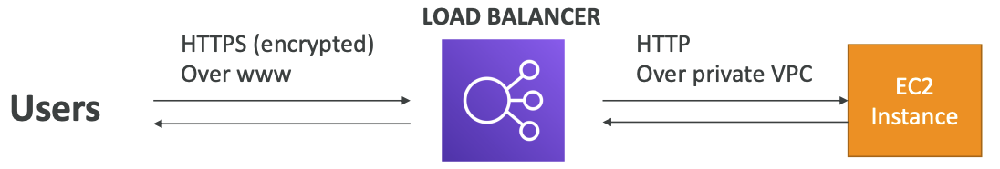

# EC2 [ Udemy ]
### EC2( Elastic Compute Cloud )
- virtual machines를 빌려주고(EC2)
- virtual drives에 데이터를 저장하고(EBS)
- machines에 로드를 분산시키고(ELB)
- auto-scaling으로 서비스를 스케일링(ASG)

#### sizing & configuration options
- OS
- CPU
- RAM
- Storage
    - netword-attached : EBS, EFS
    - hardware : EC2 Instance Store
- Network card : public IP address
- Firewall rules : security group
- Bootstrap script : EC2 User Data

#### EC2 User Data
- EC2 User data script를 통해 인스턴스를 bootstrap할 수 있다. 
- Bootstrapping은 machines을 시작할 때의 명령어를 의미한다. 인스턴스가 생성되고 맨 처음 부팅에서만 한번 실행된다.
- 설치나 업데이트 등 
- root user로 실행해야 한다

### EC2 Instance Types
EC2 instance는 원하는 스펙에 맞춰 선정해 사용하면 된다.
- Compute Optimized : batch processing 등 high performance가 필요한 경우
- Memory Optimized : 실시간 대용량 데이터 처리 등 메모리 상 대용량 데이터를 처리하는데 빠른 속도가 필요한 경우
- Storage Optimized : OLTP systems,관계형 & NoSQL DB 등 read, write 작업량이 많이 필요한 경우

#### naming convention
`m5.2xlarge`의 의미는,
- m : instance class
- 5 : generation
- 2xlarge : size within the instance class

### Security Groups
EC2 Instances의 내부로, 외부를 허용하는 traffic에 대한 제어를 담당한다.
- Ports 허용
- IP ranges( IPv4, IPv6 )
- inbound network
- outbound networkd
를 제어한다.

#### Tips 
- 여러 instances에 붙일 수 있다.
- region / VPC에 따른다.
- SSH access에 하나의 security group을 유지하는 것이 좋다.
- default로, inbound traiffic은 막혀있고, outbound traffic은 허용된다.

#### Ports
- 22 = SSH : log into Linux
- 21 = FTP : upload files 
- 22 = SFTP : upload files using SSH
- 80 = HTTP : access unsecured websites
- 443 = HTTPS : access secured websites
- 3389 = RDP : log in Windows

### SSH
- SSH로 EC2 인스턴스에 접속하기 위해서는 보안 그룹에서 프로토콜 TCP로 port 22가 열려있어야 한다. 
- 보안을 위해 key파일을 다운받아 인증히먄 SSH로 접속 가능하다.

### EC2 Instance Connect 
브라우저에서 EC2 instance에 접속할 수 있다. key file은 필요없다.
마찬가지로 port 22는 열려있어야 한다.

### EC2 Instances puchasing options
- On Demand : short workload, predictable pricing
- Reserved : 최소 1년, long workload
- Spot Instances : short workload, highest discount, max price가 현재의 spot price보다 낮으면 instance가 없어질 수 있음.  
    - batch jobs, data analysis 등에 적합
    - critical jobs / DB에는 적합하지 않음

- Dedicated Hosts : physical server
- Dedicated Instances : hardware를 공유하지 않음

### Spot Instances & Spot Fleet
Spot Fleets : Sport Instances의 묶음 + On-Demand Instances
- 가격 제한에서 target capacity를 맞추고자 한다.

Spot Instances를 할당하는데는 전략이 있다.
- lower price
- diversified
- capacityOptimized

### private vs. public vs. Elastic IP
- IPv4 : 1.16.10.240
- IPv6 : 3ffe:1900:4545:3:200:f8ff:fe21:67cf

IPv4가 가장 보통의 형식으로 [0-255].[0-255].[0-255].[0-255]. 으로 이루어진다.

#### public IP
- internet(WWW)에서 식별 가능한 IP
- 전체 웹에서 고유해야 한다.

#### private IP
- private network에서만 식별 가능하다.
- private network만에서 고유하면 된다.
- NAT + internet gateway로 인터넷에 연결된다.

#### Elastic IP
EC2 instance를 멈추거나 시작하는 경우 public IP가 바뀐다. 고정된 public IP를 가지기 위해서는 Elastic IP가 필요하다.
- 하나의 instance에만 붙여서 사용할 수 있다.
- account당 5개까지만 Elastic IP를 가질 수 있다.

### EC2 Placement Groups

#### Cluster
하나의 Availability Zone의 low-latency group에서 instance를 클러스터링한다.

- network 성능이 좋다( 10 Gbps bandwidth )
- rack failure가 발생하면 모든 인스턴스가 failure.
- 빨리 끝내야 하는 Big Data Job이나 low-latency, high network throughput가 필요한 경우에 주로 사용된다.

#### Spread
hardware에 instance를 분산시킨다.

- 여러 Availability Zones에서 분산된다.
- 여러 physical hardware에 instance를 생성한다.
- placement group에서 AZ당 인스턴스 7개까지만 지원된다.
- high availability가 필요하거나 failure를 방지하기 위해 서로 분리가 필요한 경우

#### Partition
여러 partitions를 분산시킨다.

- AZ당 partitions 7개까지만 지원된다.
- 같은 region에서 여러 AZ에 분산시킬 수 있다.
- 100 EC2 instances까지 지원된다.
- partition failure는 여러 EC2에 영향을 미치지만 다른 partitions엔 영향을 주지 않음
- metadata같은 정보를 갖고 있다.
- HDFS, HBase, Cassandra, Kafka를 사용하는 경우에 주로 사용한다.

### Elastic Network Interfaces(ENI)

- 하나의 AZ에만 bound된다.

### EC2 Hibernate
- RAM state가 유지되어 instance 부팅이 빨라진다.
- RAM state는 root EBS volume에 파일로 쓰여진다.
- root EBS volume은 encrypted
- 오래 걸리는 처리나 RAM state를 저장할 때 사용된다.

### Nitro
higher speed EBS 등 더 좋은 성능을 제공한다.

### vCPU
- 하나의 CPU에 여러 threads( multithreading )
- 4 CPU * 2 threads = 8 vCPU
- CPU당 하나의 thread만 부여하여 multithreading을 쓰지 않고 high performance computing(HPC) workload에 사용

## EC2 Instance Storage

### EBS
- EBS volume은 instance에 붙여 사용할 수 있는 network drive이다.
- 한번에 하나의 인스턴스에만 mount 가능하다.
- 특정 AZ에서만 사용 가능하다. 다른 AZ에서 사용하려면 snapshot이 필요하다.

EC2 instance 종료시, 
- default로, root EBS volume은 삭제된다.
- default로, 할당된 EBS volume은 삭제되지 않는다.

### EBS Snanpshot
특정 시점의 EBS volume의 backup(snapshot)이다.
다른 AZ나 region에 copy해서 사용할 수 있다.

### AMI
AMI는 Amazon Machine Image로, EC2 instance의 customization이다.
- 특정 region에서만 생성된다. 
- public AMI, AWS marketplace AMI, 스스로 만든 AMI에서 생성 가능하다.

### EC2 Instance Store
높은 성능의 hardware disk이다. ( EBS volume은 제한된 성능의 네트워크 드라이브이다. )
- better I/O performance
- EC2 instance가 중단되면 storage를 잃는다.
- buffer / cache / scratch data / temporary data에 주로 사용된다.

### EBS Volume Types
EBS volume은 size / throughput / IPOS에 따라 선택할 수 있다.
- gp2 / gp3 (SSD) : cost effective , low-latency. system boot volumnes 등에 사용할 수 있다.
- io1 / io2 (SSD) : 일정한 IOPS 성능을 제공한다. database workloads에 적합하다.
- st1 (HDD) : boot volume으로 사용할 수 없다. throughput optmized HDD
- sc1 (HDD) : boot volume으로 사용할 수 없다. Cold HDD

(참고) https://docs.aws.amazon.com/AWSEC2/latest/UserGuide/ebs-volume-types.html

### EBS Multi-Attach
같은 AZ내의 여러 인스턴스에 동일한 EBS volume을 할당할 수 있다.

### EBS Encryption
- 모든 snapshots은 암호화
- 모든 volumes는 암호화
- volume내 데이터는 암호화

1. volume의 EBS snapshot을 생성한다.
2. EBS snapshot 암호화
3. snapshot으로부터 새로운 EBS volume을 생성한다.
4. 인스턴스에 암호화된 volume을 할당한다.

### EFS( Elastic File System )

- 여러 EC2에 마운트할 수 있는 managed NFS( network file system )
- 여러 AZ에 인스턴스와 연동 가능
- content 관리나 web serving, data sharing 등에 사용된다.
- POSIX file system : Linux AMI에만 호환 가능하다

### EFS vs. EBS
EFS와 다르게 EBS volume은,
- 한번에 하나의 인스턴스에만 할당 가능
- 하나의 AZ에만 사용 가능
- AZ를 이전하려면 snapshot을 생성하여 다른 AZ에서 복구해야 한다. 

## High Availability and Scalability : ELB & ASG
scalability는 application이나 system이 많은 로드를 처리하는 것을 의미한다.

다음과 같이 2가지로 구분된다.
- vertical scalability : 인스턴스 자체의 크기를 늘린다. RDS, ElastiCache 같은 서비스 scale을 확장
- horizontal scalability : 인스턴스의 수를 늘린다. 분산 시스템

high availability는 주로 horizontal scalability와 쓰인다. 최소 2개의 data centers(AZ)에서 시스템을 실행시킨다.

### ELB( Elastic Load Balancing )
load balances는 여러 서버( ex. EC2 instances )에 traffic을 분산시키는 서버이다.
- 단일 point of access(DNS)를 노출시킨다.
- downstream instance의 failure를 처리한다.
- SSL termination(HTTPS)을 제공한다.
- high availability

ELB는 managed load balancer이다. 
health check를 통해 load balancer가 인스턴스가 traffic을 감당하는지 알 수 있다.

### AWS's managed load balancers
- CLB( classic Load Balancer ) : 2009, HTTP/HTTPS/TCP/SSL
- ALB( Application Load Balancer ) : 2016, HTTP/HTTPS/Websocket
- NLB( Network Load Balancer ) : 2017, TCP/TLS/UDP
- GWLB( GateWay Load Balancer ) : 2020, layer3(Network Layer)

#### CLB( v1 )

#### ALB( v2 )

- 고정된 hostname
- 여러 target groups에 라우팅
- ECS나 docker에 적합
- redirection을 지원

#### NLB( v3 )

- AZ당 하나의 static IP, Elastic IP 할당 가능
- TCP, UDP을 지원하여 성능이 좋음
- 
#### GWLB( v4 )
- 3rd party network virtual appliances fleet을 관리
- ex. Firewalls, Intrusion Detection, ..
- IP는 private IP이어야 함

### Sticky Sessions
sticky sessions : 같은 client가 load balancer를 통해도 동일한 instance로 redirect하도록 함
- CLB, ALB에서는 가능
- *cookies*는 만료일자가 있음

#### Cookies
- Application-based
    - custom cookie: target엣 의해 생성된 custom cookie
    - application cookie : load balancer에 의해 생성된 cookie
- Duration-based : load balancer에 의해 생성된 cookie

### Cross-Zone Load Balancing

### SSL
#### SSL vs. TLS
- SSL은 Secure Sockets Layer로 connections을 암호화한다.
- TLS는 Transport Layer Security( 최신 버전 )

#### SSL Certificates

#### SNI( Server Name Indication )
- SNI는 하나의 웹 서버에 여러 SSL certificate 로딩을 위함
- client가 hostname을 표시하도록 함
- ALB, NLB에만 작동함( Not CLB )

### Connection Draining
- Connection Draining - CLB
- Deregistration Delay - ALB, NLB

### Auto Scaling Group( ASG )
- load에 따라 scale in/out하여 instance를 추가하거나 제거함
- 자동으로 load balancer에 새로운 instance를 등록
- CloudWatch 알람으로 모니터링 가능하여 전체 ASG instance를 대상으로 metric이 계산됨

#### Auto Scaling Custom Metric
custom metric에 따라 스케일을 자동 조정할 수 있음

#### Dynamic Scaling Policies
- Target Tracking Scaling 
- Simple / Step Scaling
- Scheduled Actions

#### Good metrics to scale on
- CPUUtilization
- RequestCountPerTarget
- Aerage Network In / Out

# Lambda[ Udemy ]
### vs. EC2
- EC2 : virtual cloud / RAM, CPU에 제한 / 계속 실행됨 / 스케일링 직접 해야
- Lambda : virtual functions / 짧은 실행 / on-demand / 자동 스케일링
### Limits
- 메모리 할당 : 128MB - 10GB
- 최대 실행시간 : 900초
- 디스크 : 512MB
- 동시성 실행 : 1000
### Lambda@Edge
- CloudFront로 CDN을 배포할 수 있음
- ex. website security / SEO / dynamic web application