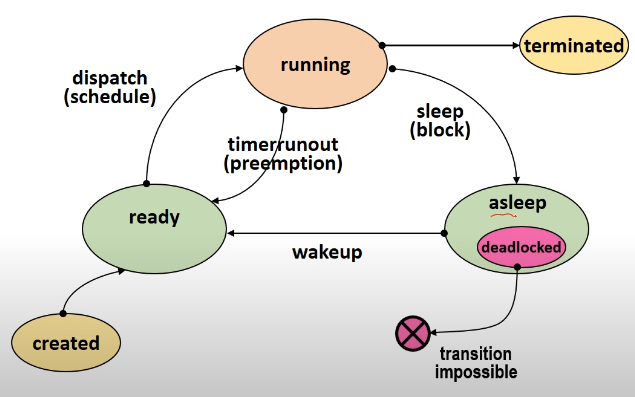

# Deadlock

프로세스가 발생 가능성이 없는 이벤트를 기다리는 것을 Deadlock state라고 한다.

위에서 asleep state에서 이벤트를 기다리는데 해당 이벤트가 발생 가능성이 없을 경우를 의미한다.

Deadlock은 자원과 밀접한 관계를 갖는다.

## 자원의 분류
#### 선점 가능 여부에 따른 분류
- Preemptible resources: 선점 당한 후 돌아와도 문제가 발생하지 않는 자원이다. 예를 들어, CPU 선점에 있어 context switching이 있고, memory 선점에서는 swap-device가 있다.
- Non-preemptible resources: 선점 당하면 이후 진행에 문제가 발생하는 자원이다. disk drive 선점에 문제가 발생할 수 있다.

#### 할당 단위에 따른 분류
- Total allocation resources: 자원 전체를 프로세스에 할당하는 경우이다. CPU, disk drive는 한번에 하나 전체를 사용한다.
- Partitioned allocation resources: 하나의 자원을 여러 조각으로 나눠 여러 프로세스에서 사용하는 것으로 memory 할당이 있다.

#### 동시 사용 가능 여부에 따른 분류
- Exclusive allocation resources: 하나의 프로세스에서 할당된 부분만 사용한다.
- Shared allocation resources: 여러 프로세스가 동시에 사용한다. 예를 들어 소스코드나 shared data 가 있다.

#### 재사용 가능 여부에 따른 분류
- SR( Serially-resuable Resources ): 계속 사용할 수 있는 자원으로 시스템 내 항상 존재한다. 사용 이후 다른 프로세스가 사용 가능하다. 
- CR( Consumable Resource ): 프로스세가 사용 후 사라지는 자원으로 signal, message가 있다. 

### Deadlock을 발생시킬 수 있는 자원의 형태
- Non-preemptible resources
- Exclusive allocation resources
- SR( Serially-resuable Resources ), CR( Consumable Resource )은 고려하기 너무 복잡하다.
- 할당 단위는 상관없다. 

### Deadlock을 발생시킬 수 있는 필요 조건
[ 자원의 특성 ]
- Non-preemptible resources
- Exclusive allocation resources

[ 프로세스의 특성]
- Hold and wait: 자원을 하나 hold하고 다른 자원 요청하는 경우
- Circular wait 

## Deadlock Model

### Graph Model
### State Transition Model

