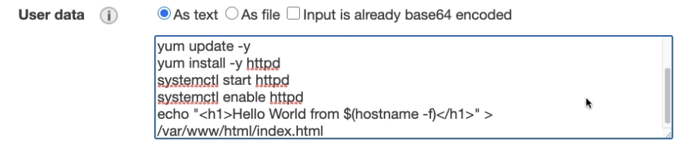

# EC2
### EC2( Elastic Compute Cloud )
- virtual machines를 빌려주고(EC2)
- virtual drives에 데이터를 저장하고(EBS)
- machines에 로드를 분산시키고(ELB)
- auto-scaling으로 서비스를 스케일링(ASG)

EC2 User data script를 통해 인스턴스를 bootstrap할 수 있다. Bootstrapping은 machines이 시작할 때의 launching 명령어를 의미한다. 인스턴스가 생성되고 맨 처음 boot에서 적용된다.

### EC2 Instance Types
EC2 instance는 원하는 스펙에 맞춰 선정해 사용하면 된다.

### Security Groups

### SSH
SSH로 EC2 인스턴스에 접속하기 위해서는 보안 그룹에서 프로토콜 TCP로 port 22가 열려있어야 한다. 
보안을 위해 key파일을 다운받아 인증히먄 SSH로 접속 가능하다.

### EC2 Instance Connect 

### EC2 Instance Lanch Types

### Spot Instances & Spot Fleet

### EC2 Instances puchasing options
- On Demand : short workload
- Reserved : long workload
- Spot Instances : short workload, highest discount
- Dedicated Hosts : physical server

### private vs. public vs. Elastic IP

### EC2 Placement Groups
- Cluster : great network
- Spread 
- Partition

### Elastic Network Interfaces(ENI)

### EC2 Hibernate

## EC2 Instance Storage

### EBS

### EBS Snanpshot

### AMI

### EC2 Instance Store

### EBS Volume Types

### EBS Multi-Attach

### EBS Encryption

### EFS

### EFS vs. EBS 