# Memory Management

### 메모리의 종류
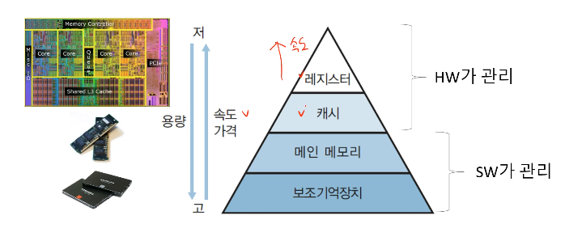

### 메모리 계층구조
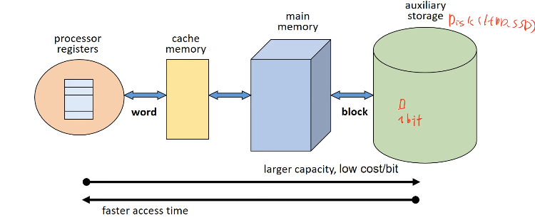

- block : 디스크에서 1bit를 메모리에 올리는 최소 단위. 보조기억장치와 주기억장치 사이의 데이터 전송 단위이다. block 단위만큼 메모리에 올라간다. 
- word: 메모리에서 레지스터에 올라가는 데이터 전송 단위. 32bit PC, 64bit PC에서의 bit 단위가 word 크기를 의미한다.

### Address Binding
프로그램 논리 주소를 실제 메모리의 물리 주소로 매핑하는 작업을 의미한다. 
- Compile time binding : 프로세스가 메모리에 적재된 위치를 컴파일러가 알 수 있는 경우.
- Load time binding: 메모리 적재 위치를 컴파일 시점에서 모르면 상대 주소로 생성한다. 적재 시점에 시작 주소를 반영하여 로드할 시 주소를 재설정한다.
- Run time binding: ready 에서 running에서 주소를 할당한다. 대부분의 OS가 사용하는 방식이다.

### Dynamic Loading
모든 루틴을 교체 가능한 형태로 디스크에 저장한다.

### Swapping
swap-in, swap-out

## Memory Allocation

### Continuous Memory Allocation
프로세스를 하나의 연속된 메모리 공간에 할당하는 정책이다. 프로그램 하나가 전체로 메모리에 올라간다.

#### Uni-programming
프로세스에 한번에 하나만 올라가는 경우(  Multiprogramming degree = 1)
- 프로그램의 크기가 메모리 크기보다 클 경우, Overlay structure로 메모리에 현재 필요한 영역만 적재한다.
하지만 사용자가 프로그램의 흐름과 자료구조를 알고 있어야 가능하다.
- 커널을 보호하기 위해 경계 레지스터( boundary register )를 사용한다.
- 하나의 프로세스만 올라가기에 시스템의 활용도가 낮다. 

#### [ Multi-programming ] Fixed Parition Multiprogramming

- 메모리 공간을 고정된 크기로 미리 분할한다. 
- 각 프로세스는 하나의 partition에 적재된다. 
- Multiprogramming degree가 분할한 고정 크기와 동일하다.
- 단편화가 발생하여 메모리가 낭비되는 문제가 있다.

[ Fragmentation ]
- Internal Fragmentation : Partition 크기 > Process 크기

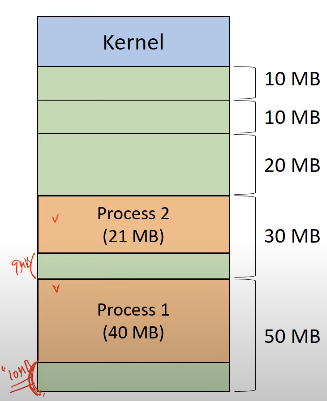

Process1, 2 에서 할당된 메모리 공간 외의 남는 9MB, 10MB를 내부 단편화가 발생하여 메모리가 낭비된다.

- External Fragmentation: 남은 메모리 크기 > Process 크기 이지만, 연속된 공간이 아닌 경우이다. 마찬가지로 메모리 낭비가 발생한다.

#### [ Multi-programming ] Variable Parition Multiprogramming

- 프로세스를 처리하는 과정에서 필요할 때 메모리 공간을 동적으로 분할한다. 

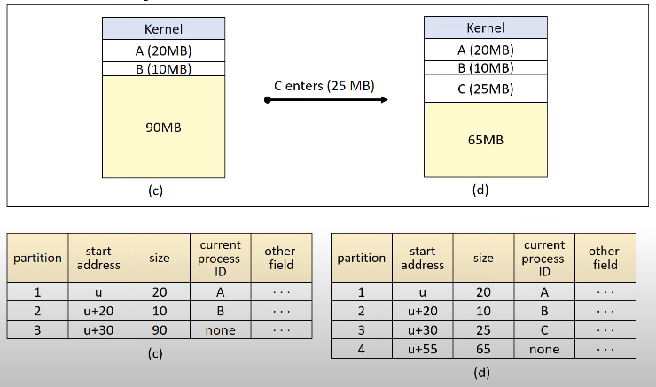

partion이 요청한 크기에 따라 할당된다.

[ 배치 전략 ]

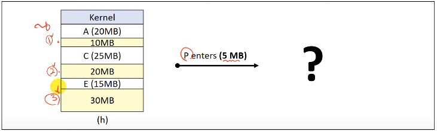

새로 들어오는 프로세스 P에 대해 남는 공간 중 어디에 배치할 것인가.

- First-Fit(최초 적합): 충분한 크기를 가진 partition 중 첫 번쨰를 선택한다. 간단하고 overhead가 적지만 공간 활용률이 떨어질 수 있다. -> (1)
- Best-Fit(최적 적합): 프로세스가 들어 갈 수 있는 partition중 가장 작은 곳을 선택한다. 모든 partition을 탐색해야 해서 overhead가 크다. 하지만 크기가 큰 partition을 유지할 수 있다. -> (1)
- Worst-Fit(최악 적합): 프로세스가 들어 갈 수 있는 partition중 가장 큰 곳을 선택한다. 모든 partition을 탐색해야 해서 overhead가 크다. 크기가 작은 partition을 유지할 수 있으나 큰 공간의 partition 확보가 어렵다. -> (3)
- Next-fit(순차 최초 적합): 마지막으로 탐색한 위치부터 탐색한다. 메모리 영역의 사용 빈도를 균등화할 수 있고 overhead가 작다. 

[ External fragmentation issue ]

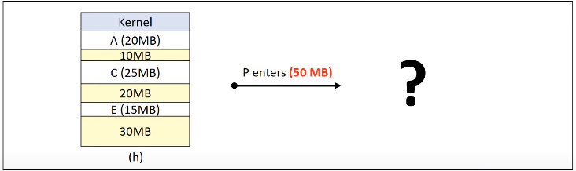

- Coalescing holes(공간 통합): 인접한 빈 영역을 하나의 partition으로 통합하여 공간을 확보하여 수행한다. 
- Storage Compaction(메모리 압축): 모든 빈 공간을 하나로 통합한다. 기존의 메모리에서 돌아가던 프로세스를 중지하고 재배치하여 overhead가 크다.

### Non-Continuous Memory Allocation
가상 메모리가 Non-Continuous Memory 할당에 해당된다.

# Virtual Memory
프로그램을 여러 개의 block으로 분할하여 메모리에 올라간다.  
실행 시 필요한 block만 메모리에 적재되고 나머지 block은 swap device( DISK )에 존재한다.

### Address Mapping
Virtual Address가 Real Address로 변환되는 것을 의미한다.
- Virtual Address(가상주소): 연속된 메모리 할당을 가정한 주소로 논리주소이다.
- Real Address(실제주소): 실제 메모리에 적재된 주소

### Block Mapping
사용자 프로그램은 block단위로 분할 및 관리된다. 

- Virtual address : v=(b,d)
    - b = block number
    - d = 시작점(b)으로부터 떨어진 위치( offset )

#### Block map table(BMT)
kernel공간에 프로세스마다 하나의 BMT를 가진다. 

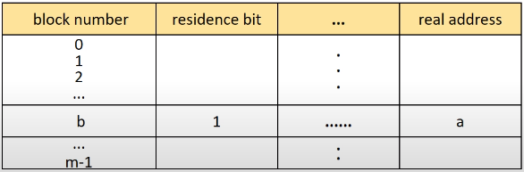

- residence bit: 메모리에 올라가 있는가에 대한 여부

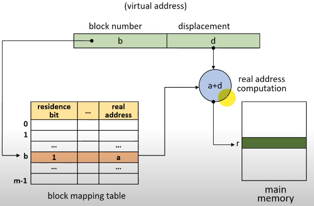

- b에 실제 메모리에 위치한 주소는 residence bit가 1이므로 real addres + distance인 a+d로 알 수 있다.
- residence bit = 0인 경우 swap device 에서 해당 블록을 메모리에서 가져와 다음으로 넘어간다.

## [ Virtual Storage Methods ] Paging system
프로그램을 같은 크기의 block인 *page*로 분할한다.
- page frame: 메모리의 분할 영역으로 page와 같은 크기이다.
- 논리적 분할이 아닌 크기에 따라 분할한다. 논리적인 구조를 고려하지 않은 문제가 있다.( Segmentation system이 필요한 이유 )
- external fragmentation이 존재하지 않지만 internal fragmentation이 존재한다.

### Address Mapping
- Virtual address: v=(p,d)
    - p: page number
    - d: displacement(offset)
- Page Map Table(PMT)를 사용한다.

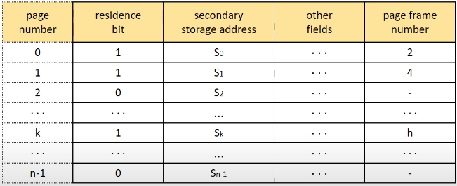

#### Direct mapping
- Block mapping과 유사하다.
- PMT를 커널 안에 저장된다. 

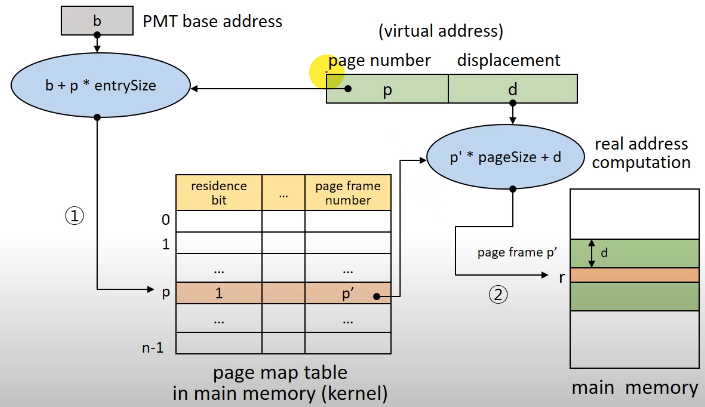

- residence bit = 0인 경우(*page fault*) swap device 에서 해당 블록을 메모리에서 가져와 다음으로 넘어간다.
- b에 실제 메모리에 위치한 주소는 residence bit가 1이므로 page number*page entry + distance인 p*pagesize + d로 알 수 있다.

Direct mapping에서는 메모리 접근 횟수가 2배로 증가하여 해결 방안으로 Associative mapping(TLB)를 사용하게 된다. PMT를 참고하고, 메모리 주소를 접근하는데 메인 메모리에 2번 접근하게 된다. 
page fault가 발생하면 디스크에 접근해야 하므로 overhead가 커진다.

#### Associative mapping
- TLB(Translation Look-aside Buffer)에 *PMT*에 적재한다. Associative high-speed memory로 PMT를 병렬 탐색한다.
- overhead가 적고 속도가 빠르다.
- 하드웨어가 비싸므로 큰 PMT를 다루기가 어렵다.

####  Hybird Direct/Associative Mapping
- Direct mapping + Associative Mapping
- 작은 크기의 TLB를 사용한다: PMT는 메모리(커널)에 저장하고 일부 entry를 PMT에 적재한다.
- Locality의 특성을 이용해 최근에 사용된 page들을 PMT에 올린다.

### Memory Management
#### Page Sharing
여러 프로세스가 특정 page를 공유 가능하다( 프로그램 부분만 할당하기에 가능하다. ).
프로세스들이 공유되는 page에 대한 정보를 PMT의 같은 entry에 저장한다.

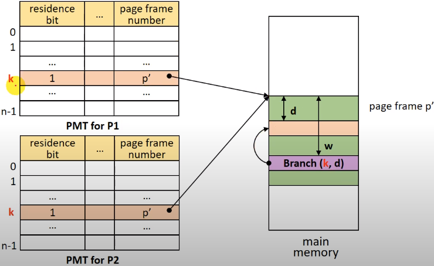

공유하려는 페이지(p')에 대한 이름(entry)을 k라고 통일한다.

#### Page Protection
여러 프로세스가 page를 공유할 때 접근 권한을 명시하는데 protection bit를 사용한다.

## [ Virtual Storage Methods ] Segmentation system
프로그램을 논리적 block인 *segment*로 분할한다.
- block의 크기가 서로 다를 수 있다.
- 미리 block을 분할하지 않기에 메모리를 미리 분할하지 않는다.
- paging system에 비해 관리 overhead가 크다.
 
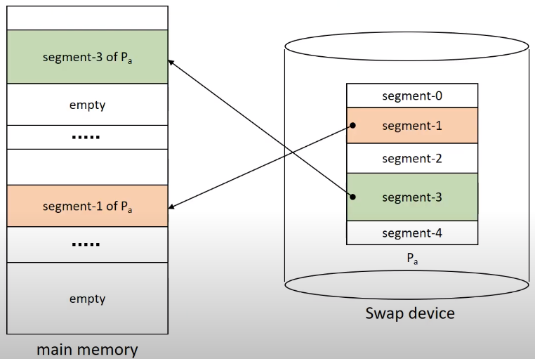

### Address Mapping
- Virtual address: v=(s,d)
    - s: segment number
    - d: displacement(offset)
- Segment Map Table(SMT)를 사용한다.

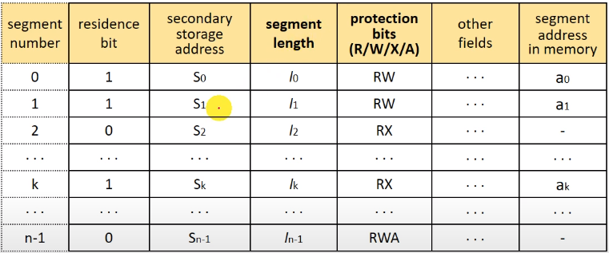

- segment length: segement의 크기가 다 다르기에 크기를 기록
- protection bit: 프로세스에 대한 권한을 기록

#### Direct mapping

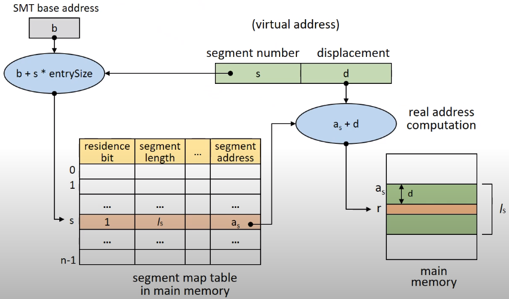

- SMT에서 segment s의 entry = b + s*entrySize 
- residence bit = 0인 경우(*segment fault*) swap device 에서 해당 블록을 메모리에서 가져와 다음으로 넘어간다.
- d > segment length인 경우 segment overflow exception이 발생한다.
- protection bit에 따라 허가되지 않은 연산일 경우 segment protection exception이 발생한다.

### Memory Management
VPM 과 유사하여 segment 적재 시 크기에 맞추어 분할 후 적재한다.

#### Segment Sharing / Protection
논리적으로 분할되어 있어 공유 및 보호가 용이하다.

## [ Virtual Storage Methods ] Hybrid paging/segmentation system

paging과 segmentation의 장점을 결합한다.
- page sharing/protection 이 쉽고 메모리 관리 overhead가 작다.
- external segmentation은 없으나 internal segmentation이 발생할 수 있다.
- 전체 테이블 수가 증가하여 메모리 소모가 크고 address mapping이 복잡하다.

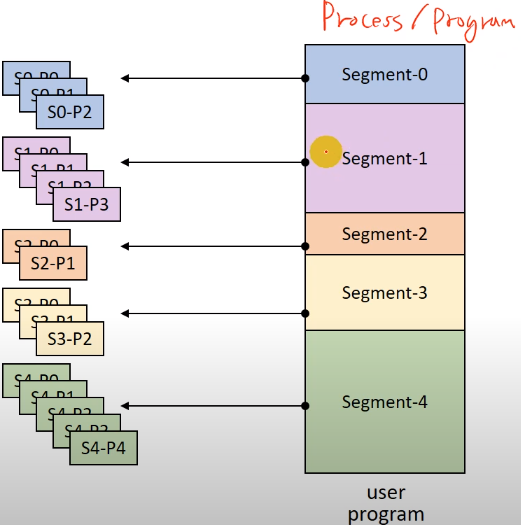

논리적인 단위의 block으로 분할하고 각 segment를 같은 크기의 page로 잘라 메모리에 올린다.

### Address Mapping
- Virtual address: v=(s,p,d)
    - s: segment number
    - p: page number
    - d: displacement(offset in a page)
- SMT, PMT를 모두 사용한다: 각 프로세스마다 하나의 SMT를 갖고 각 segment는 하나의 PMT를 갖는다.
- 메모리 관리: page가 올라가기에 paging system과 유사하다.

[ SMT ]  
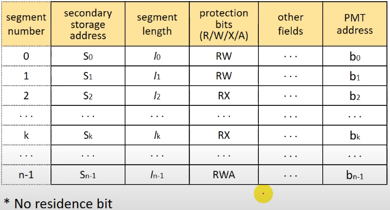

[ PMT ]  
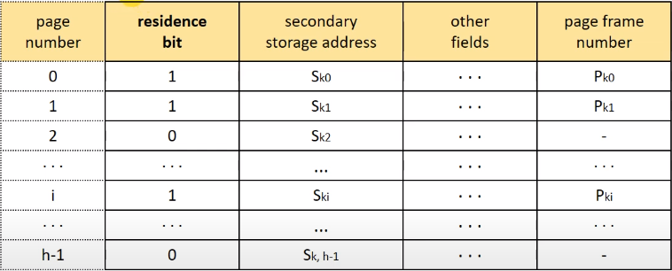
 
#### Direct mapping

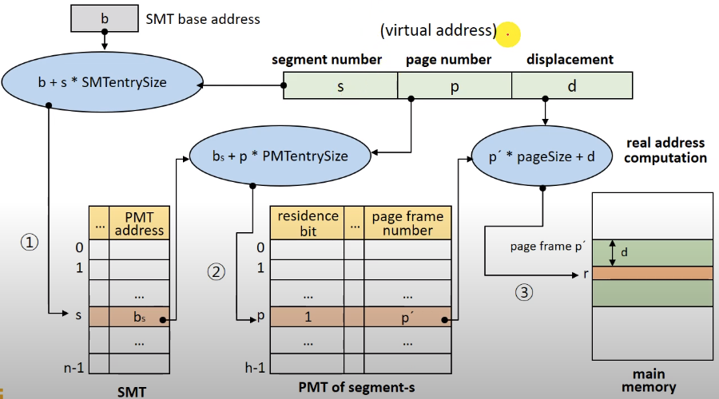

메모리 접근이 3배로 늘어난다.
