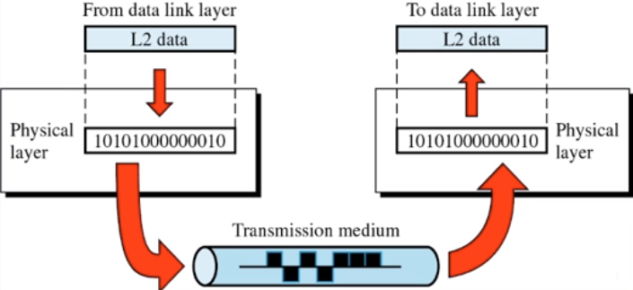

# About Network
## Web Design Pattern - MVC vs. MTV

### MVC(Model-View-Controller)

유저가 Controller를 조작하면 Model을 통해 데이터를 가져오고 데이터를 View를 통해 전달한다.
- Model : 쿼리에 대한 정보를 정의하여 DB에 접근하고 CRUD를 명시한다.  
- View : Controller로부터의 데이터를 브라우저에 랜더링하도록 변환한다.
- Controller : Model과 View사이의 로직을 담당하여 유저가 Model에 맞는 인자값을 요청한다.

## HTTP
HTTP(HyperText Transfer Protocol)은 stateless 프로토콜이다. 

- TCP/IP 상에서 작동 
- Connectless :  
요청해서 응답을 받으면 연결을 끊는다.
- Stateless :   
    stataless는 데이터를 주고 받는 요청이 서로 독립적이라는 의미다.  
    즉, 이전과 이후의 데이터 요청은 관련이 없다.
    이에 따라 서버는 세션과 같은 추가 정보를 관리하지 않아도 되고 다수의 요청에 의한 부하를 줄일 수 있는 이점이 있다. 하지만 클라이언트가 이전에 로그인 되더라도 
    정보를 유지할 수 없어 HTTP는 Cookie를 이용한다.

### HTTP Request & HTTP Response

- URL 분석 및 접속 : 서버 IP주소와 port를 이용하여 TCP/IP 연결을 요청한다.
- Request Header 전송
- Request Body 전송
- Response Header 해석 : 상태 코드를 확인하고 Body의 Content-Type을 해석한다.
- Reponse Body 해석

#### Request

#### Response

### URL Format

### HTTP Methods
- GET( 요청 )
- POST( 생성 )
- PUT( 수정 )
- DELETE( 삭제 )
- HEAD( 서버 헤더 정보, Body 반환하지 않음 )
- OPTIONS( 서버 옵션 확인 )

### HTTP 상태 코드
- 2xx : 성공( 200, 204, .. )
- 3xx : redirection( 301, 303, .. )
- 4xx : 클라이언트 오류( 400, 401, 403, ..)
- 5xx : 서버 오류( 501, 503, ..)

### vs. HTTPS
SSL은 보안을 위해 개발한 통신 layer이다. HTTPS는 SSL위에 HTTP를 통과시켜 암호화해서 주고 받는 형식이다.

*(출처)*
- https://joshua1988.github.io/web-development/http-part1/
- https://velog.io/@dnjscksdn98/HTTP-%ED%94%84%EB%A1%9C%ED%86%A0%EC%BD%9C%EC%97%90-%EB%8C%80%ED%95%98%EC%97%AC

## OSI 7 Layer - TCP/IP

*(출처) https://mangkyu.tistory.com/15*
*(참고) https://helloworld-88.tistory.com/146*

### OSI 7 Layers

[ User Process ]

1. Application : Email, FTP, ..
2. Presentation 
3. Session : 논리적 접속

[ Kernel ]

4. Transport : TCP/UDP 프로토콜을 활용, 양쪽 간의 신뢰성 보장
5. Network : IP 주소 체계( IPv4, IPv6 )에 따라 경로 설정
6. Datalink : 두 node간 통신
7. Physical : 이진bit로 전달

#### Physical( 물리 계층 )

## TCP vs. UDP

### TCP
TCP는 인터넷 상에서 데이터를 메시지 형태로 보내기 위해 IP와 함께 사용하는 프로토콜이다.
일반적으로 IP와 함께 사용하는데 TCP는 패킷을 추적, 관리한다.  

- 연결형 서비스로, 가상 회선 방식을 제공(발신지 - 수신지를 연결하여 논리적 경로를 배정)
- 연결은 3-way handshaking( 목적지와 수신지를 확실히 하여 정확한 전송을 보장하고자 )으로, 해제는 4-way handshaking로 한다.
- 높은 신뢰성
- UDP보다 속도는 느림
- Point to point 방식
- 서버 : 클라이언트 연결이 1:1 연결

[ TCP Flow ]  

#### UDP
UDP는 데이터를 데이터그램(독립적인 관계를 지닌 패킷) 단위로 처리하는 프로토콜이다.  

- 비연결형 서비스로, 데이터그램 방식을 제공
- UDP 헤더의 CheckSum 필드를 통해 최소한의 오류만 검출
- 낮은 신뢰성
- TCP보다 속도가 빠름( 실시간 서비스에 주로 사용 )
- 서버 : 클라이언트는 N:M 연결이 가능

[ UDP Flow ]  

*(출처) https://mangkyu.tistory.com/15*