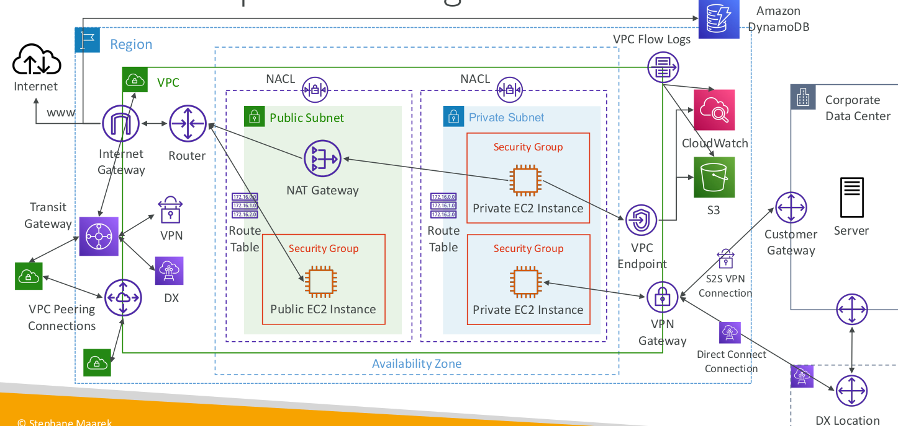
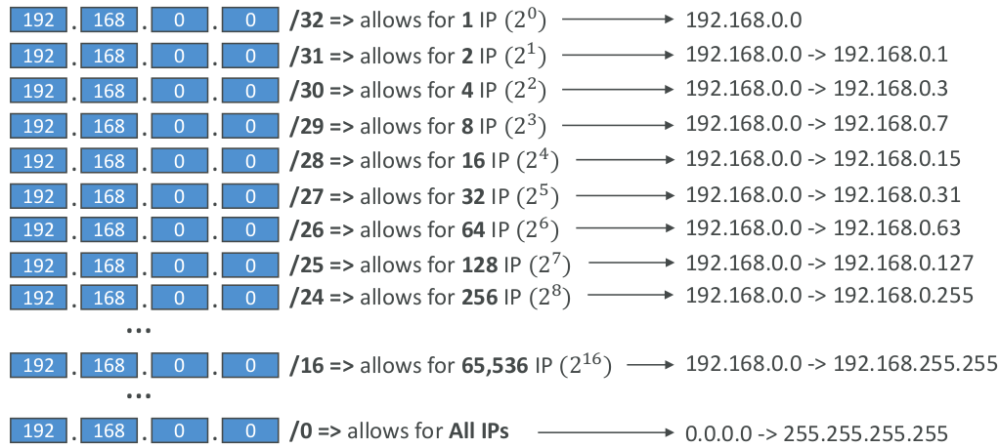
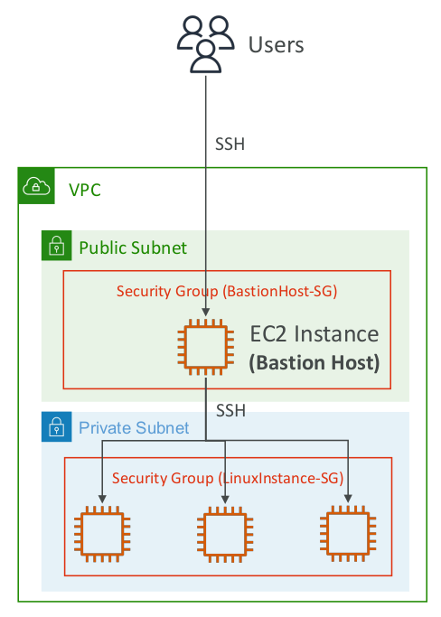
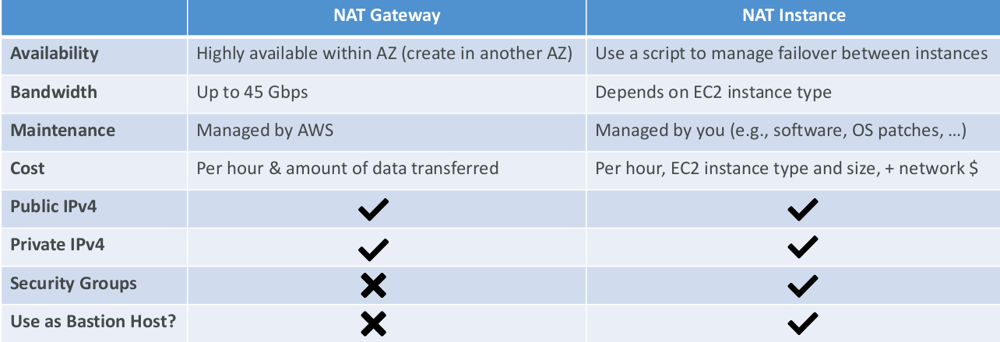

# Amazon Route 53

Route 53는 가용성, 확장성이 우수한 DNS 웹 서비스이다. 
DNS를 상태 확인 서비스와 결합하여 정상적인 엔드포인트로 트래픽을 라우팅하거나 개별적으로 엔드포인트에 대한 모니터링을 설정할 수 있다.

공개 DNS 레코드를 생성하고 관리할 수 있다.

- 각각의 Route 53 호스팅 영역은 고유의 가상 DNS 서버 집합을 갖는다. 호스팅 영역에 대한 DNS 서버 이름은 호스팅 영역이 생성될 때 시스템에서 할당됨
    - 도메인 : 일반적인 DNS 개념. ex) www.example.com
    - 호스팅 영역 : 상위 도메인 이름에 속하면서 관리가 가능한 레코드 세트. ex) amazon.com 호스팅 영역에는 www.amazon.com이나 www.aws.amazon.com같은 레코드 형식만 포함될 수 있음

- 실제 서비스 사용을 기반으로 비용을 청구
- IAM 서비스로 엑세스 제어 

## DNS
DNS는 www.example.com과 같이 사람이 읽을 수 있는 이름을 192.0.2.1과 같은 숫자 IP로 변환하는 배포 서비스이다.  
DNS 서버는 이름을 IP주소로 변환하여 도메인 이름을 웹 브라우저에 입력할 때 최종 사용자를 어떤 서버에 연결할지 제어한다.( 쿼리 )

- AWS Route 53에서는 애니캐스트 네트워크를 사용함
- AWS Route 53 계정당 최대 500개 호스팅 영역, 호스팅 영역 당 10000개의 리소스 레코드 세트로 제한
- 동일한 도메인 이름에 대해 여러 개의 호스팅 영역 생성 가능 
- 웹 사이트 호스팅은 제공하지 않음 : S3를 사용하면 정적 웹 사이트를 호스팅하거나 동적 웹 사이트 및 기타는 EC2를 사용
- 리소스 레코드 세트에 대한 변경 사항이 트랜잭션으로 처리됨
- 여러 개의 IP주소를 단일 레코드와 연결하여 웹 서버의 부하량을 분산시킬 수 있음

### DNS 라우팅 정책
- weighted round robin을 지원함
- LBR(지연 시간 기반 라우팅)은 전 세계 수십 개의 다른 엣지를 검색하여 최종 사용자를 지연 시간이 가장 낮은 AWS 리전으로 라우팅함
- 지역 DNS 기능 : 지리적 위치를 기반으로 특정 엔트포인트로 요청을 보내 로드 균형을 맞출 수 있는 기능
    - 사용 가능한 모든 위치에서 DNS 쿼리에 응답할 수 있도록 글로벌 레코드를 구성하길 권장됨
- 지역 기반 라우팅 vs. 지역 DNS 기능 : 지역 DNS는 요청이 발생한 지리적 위치에 따라 라우팅을, 지역 기반 라우팅은 최종 사용자 네트워크와 AWS 데이터 센터간 지연 시간 측정값을 기반으로 라우팅을 제공함. 최종 사용자 지연 시간 최소화가 목표이면 지역 시간 기반 라우팅을 사용하는 것이 좋음

# Amazon VPC
>>Udemy

## CIDR - IPv4

### Subnet Mask
IP에서 얼마나 많은 bits를 정의할 수 있는지

VPC는 private이기에 Private IPv5 ranges만 가능하다.

## Internet Gateway
- VPC와 독립적으로 생성된다.
- 하나의 VPC는 하나의 Internet Gateway와 연동된다.
- 자체로는 internet에 접근할 수 없고 라우트 테이블이 필요하다.

## Bastion Hosts

- private EC2 인스턴스에 접속할 때 사용한다.
- bastion은 public subnet 안에 존재하고 다른 private subnet내부에 연결된다.

## NAT 
NAT = Network Address Translation

### NAT Instance
- outdated
- private subnet 안의 EC2 인스턴스가 인터넷에 연결될 수 있도록 한다.
- public subnet에서 시작되어야 한다.
- EC2 설정에서 Source/ destination Check를 비활성화시켜야 한다.
- EIP를 할당시켜야 한다.
- Route Table이 private subnet에 대해 설정되어 있어야 한다.

### NAT Gateway
- AWS-managed NAT로, bandwidth, availability가 높다.
- 시간당 usage, bandwidth마다 청구된다.
- EIP를 할당시키고, 특정 AZ에 사용된다.
- 같은 subnet에서 사용될 수 없다.
- Internet Gateway가 필요한데,  private subnet -> NATGW -> IGW로 작동한다.

# Amazon API Gateway

# Amazon CloudFront

# AWS Direct Connect

# AWS Transit Gateway
