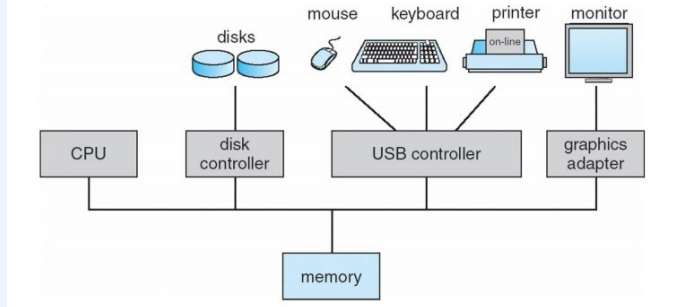
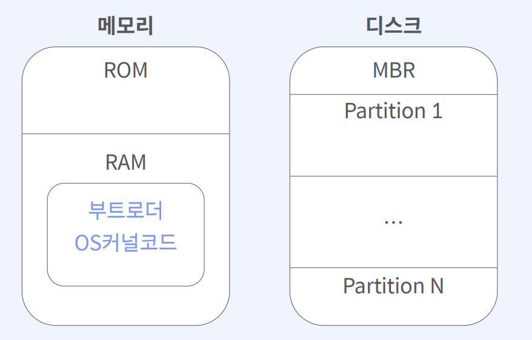
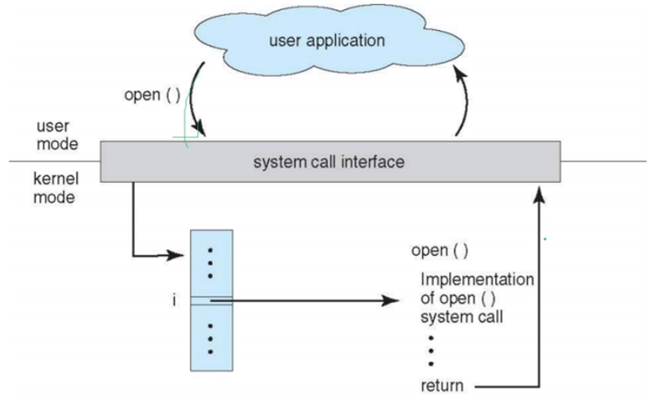
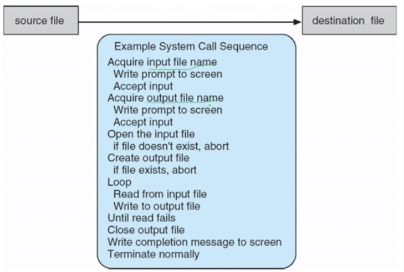

# About OS
## Overview 
### 컴퓨터 시스템의 기본 구성
- 하드웨어
- 운영체제
- 응용 프로그램
- 사용자

### 역할
- 리소스 할당의 주체 : 모든 리소스를 관리하고 자원 요청에서 효율적이고 공정하게 리소스를 분배한다. 
- 제어 프로그램 : 프로그램 실행을 제어한다.

- CPU, dick controller 등은 공유된 메모리에 대한 접근을 위해 공용버스를 통해 연결된다.

### 컴퓨터 부팅

[ 부트스트랩 ]
1. 메인보드에 전력을 공급한다.
2. ROM, EEPROM에 저장된 BIOS 루틴을 시작한다.
3. BIOS는 셀프테스트로 주변 하드웨어를 체크한다.
4. 부트스트랩 실행 : MRP(Master Boot Record)에 존재하는 부팅정보를 읽어온다.
5. RAM에 Bootloader를 적재한다.

### 인터럽트
CPU가 프로그램을 구동 중인데 입출력이나 예외 상황 발생에 대해 CPU에 신호를 보내는 것을 의미한다. 

- 하드웨어 인터럽트: 하드웨어의 의해 발생
- 소프트웨어 인터럽트 : 소트프웨어에 의해 발생. 사용자 프로그램이 인터럽트를 발생시키는 것으로 supervisor call이 있다.

인터럽트는 서비스 루틴으로 제어를 전송한다. 인터럽트 서비스 이후에 저장된 복귀 주소를 카운터에 적재하여 중단된 프로세스를 재개한다. 인터럽트에 의해 중단된 명령어 주소를 반드시 저장한다.

### 운영체제 서비스
사용자의 편의성을 위해 제공하는 기능은 아래와 같다.
- 유저 인터페이스 제공
- 프로그램 실행
- I/O 수행 : 실행 프로그램에 입출력이 필요한 경우
- 파일시스템 조작 : 파일 및 디렉토리 읽기/쓰기/생성/삭제를 지원한다.
- 통신 : 내부/외적적으로 컴퓨터 시스템의 프로세스 간에 통신

효율적인 시스템을 위해서는 아래와 같이 편의를 제공한다.
- 리소스 할당 
- 로깅
- 보호 및 보안 

### 시스템콜
응용프로그램에서 운영체제에 시스템자원을 수행해달라 하는 하나의 수단이다.

[ `cp in.txt out.txt` 시스템콜 발생과정 ]  

유저 모드와 커널 모드로 나뉘어 유저가 커널에게 시스템콜을 요청한다. 커널은 시스템콜 결과를 유저에게 반환한다.

커널 모드에서는 내부적으로 다음과 같은 시스템콜 역할을 수행한다.  

#### 유형
- 프로세스 제어 : 프로세스 생성, 종료, 로드, 실행, 메모리 할당 등
- 파일 관리 : 파일 생성, 삭제, 열기 등 
- 장치 관리 : 장치 요청, 해제 
- 정보 유지 : 시스템 데이터, 날짜 가져오기
- 통신 : 통신 연결 생성 및 삭제 등
- 보호 : 파일 권한 얻기 및 설정 등

## 프로세스
**실행중인** 프로그램으로 디스크에 저장된 수동적 파일이 메모리에 적재될때 프로세스가 된다. 

- 스택 세션 : 함수 호출 시 임시 데이터를 저장하는 공간
- 힙 세션 : 프로그램 실행 시 동적으로 할당되는 메모리
- 데이터 세션 : 전역변수
- 텍스트 세션 : 실행 코드

각 프로세스는 프로세스 제어 블록( PCB )에 의해 표현된다.
- 프로세스 상태 : New / Ready / Running / Waiting / Halted
- 프로세스 카운터 : 프로세스가 다음에 실행할 명령어 주소
- 레지스터
- 메모리 관리 정보 
- CPU 스케줄링 정보

### 스케줄링
프로세스 스케줄러는 CPU에서 실행 가능한 여러 프로세스들 중에서 하나의 프로세스를 선택한다.

## Memory의 4영역
메모리는 코드 / 데이터 / 스택 / 힙 영역으로 구분된다.
- 코드 영역: 실행할 프로그램의 코드가 저장된다. CPU는 저장된 명령어를 하나씩 처리하게 된다.
- 데이터 영역: 전역 변수와 정적 변수를 저정하여 프로그램 시작시 할당되며 종료시 소멸된다.
- 스택 영역: 지역변수와 매개변수를 저장하는 공간으로 함수의 호출과 함께 할당되며 호출이 끝나면 소멸된다.
- 힙 영역: 사용자의 동적 할당으로 생성되는 공간으로 직접 메모리 할당을 할 수 있다. 

데이터와 스택 영역의 메모리 크기는 컴파일 시 미리 결정되나 힙 영역은 런타임 중에 결정된다.

출처: https://armontad-1202.tistory.com/entry/%ED%8C%8C%EC%9D%B4%EC%8D%AC%EC%9D%98-%EB%A9%94%EB%AA%A8%EB%A6%AC-%EC%98%81%EC%97%AD