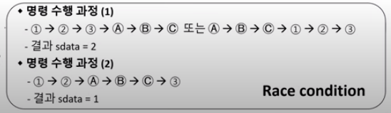
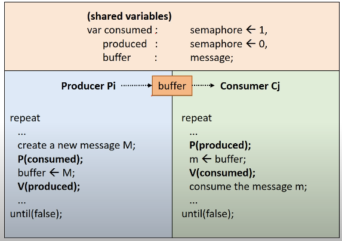
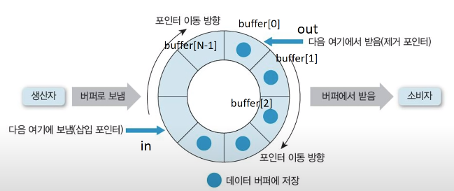

# Prcoess Synchronization and Mutual Exclusion
동기화란 프로세스들이 서로 정보를 공유하여 동작을 맞추는 것을 의미한다.
병행 수행중인 비동기적 프로세스들이 공유자원에 동시 접근할 때 문제가 발생하므로 동기화가 필요하다.

- Shared Data: 여러 프로세스가 공유하는 데이터
- Critical Section: 공유 데이터를 접근하는 코드 영역
- Mutual Exclusion: 둘 이상의 프로세스가 동시에 Critical Section에 진입하는 것을 방지한다.

## Critical Section
- 각 프로세스에서 공유 데이터를 접근하는 프로그램 코드 부분을 의미한다.
- Machine Instruction: Atomicity, Indivisible의 특징으로 한 기계어 명령의 실행 도중에는 인터럽트 받지 않는다.


1,2,3,A,B,C은  Machine Instruction로 인해 개입될 수 없다. 1,2,3,A,B,C은 각각 끝날때 preemption이 발생할 수 있는데 순서에 따라 다른 결과가 나올 수 있다.



Race condition은 동시에 여러 프로세스가 동일한 자료를 접근할 때 접근 순서에 따라 다양하게 변할 수 있음을 의미한다.

## Mutual Exclusion
프로세스가 Critical Section가 있을 때 다른 프로세스가 진입하는 것을 막는다. 동기화를 위해 공유되는 변수를 한 프로세스가 사용 중일 때, 변수 이용이 끝나기 전까지 다른 프로세스가 사용하는 것을 막아준다.

### Mutual Exclusion Primitives( 기본연산 )
- enterCS() primitive:Critical Section진입 전 검사
- exitCS() primitive: Critical Section 벗어날때의 후처리 과정

### Mutual Exclusion Primitives 요구
- Mutual Exclusion
- Progress( 진행 ): Critical Section안에 있는 프로세스 외에는 다른 프로세스가 진입하는 것을 방해하지 않는다.
- Bounded waiting( 한정대기 ): Critical Section에 대한 진입 요청이 있을 때, 무한 대기 없이 진입할 수 있어야 한다.

## SW Algorithm

### Dekker's Algorithm
- Two process Mutual Exclusion을 보장하는 최초의 알고리즘
- `flag`: 프로세스 중 누가 임계 구역에 진입할지에 대한 변수
- `turn`: 누가 임계 영역에 들어갈 차레인지에 대한 변수

```sh
f0 ← false
f1 ← false
turn ← 0   // or 1

 p0:                                 p1:
     f0 ← true                         f1 ← true
     # f1이 진입한 상태 -> 대기          # f0이 진입한 상태  -> 대기
     while f1 {                         while f0 {
         if turn ≠ 0 {                      if turn ≠ 1 {
             f0 ← false                         f1 ← false
             while turn ≠ 0 {                  while turn ≠ 1 {
             }                                   }
             f0 ← true                          f1 ← true
         }                                   }
     }                                    }

    // 임계 구역                          // 임계 구역 
    ...                                   ...
    // 나머지 구역                        // 나머지 구역
   turn ← 1                             turn ← 0
   f0 ← false                           f1 ← false
```
출처: https://ko.wikipedia.org/wiki/%EB%8D%B0%EC%BB%A4%EC%9D%98_%EC%95%8C%EA%B3%A0%EB%A6%AC%EC%A6%98

#### Dijkstra Algorithm

## HW Algorithm

### TestAndSet( TAS ) instruction
busy waiting의 문제가 있다.

## OS supported SW Algorithm
### Spinlock
- 정수 변수
- 초기화, P(), V() 연산으로만 접근 가능
    - P() : Lock 개념의 연산
    - V() : Unlock 개념의 연산

멀티 프로세서 시스템에서만 사용 가능
Busy waiting

### Semaphore
- Busy waiting 문제 해결
- 음이 아닌 정수형 변수(S)
    - 초기화 연산, P(), V()로만 접근
- 임의의 S 변수 하나에 ready queue하나가 할당된다.

#### Binary Semaphore
- S가 0, 1 두 종류의 값만 갖는 경우
- 상호 배제나 프로세스 동기화의 목적으로 사용

#### Counting Semaphore
- S가 0 이상의 정수값을 가질 수 있는 경우
- Producer-Consumer 문제 등을 해결하기 위해 사용

#### 문제 해결
[ Mutual Exclusion ]

[ Process synchoronization ]
- Process 들의 실행 순서 맞추기

[ Producer-Consumer ]

- Producer-Consumer problem with single buffer



- Producer-Consumer problem with N-buffers

