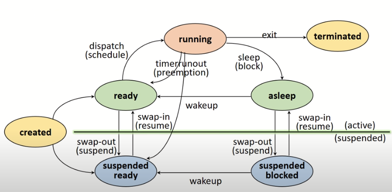
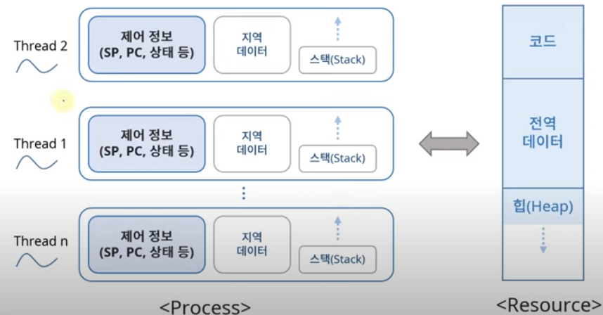
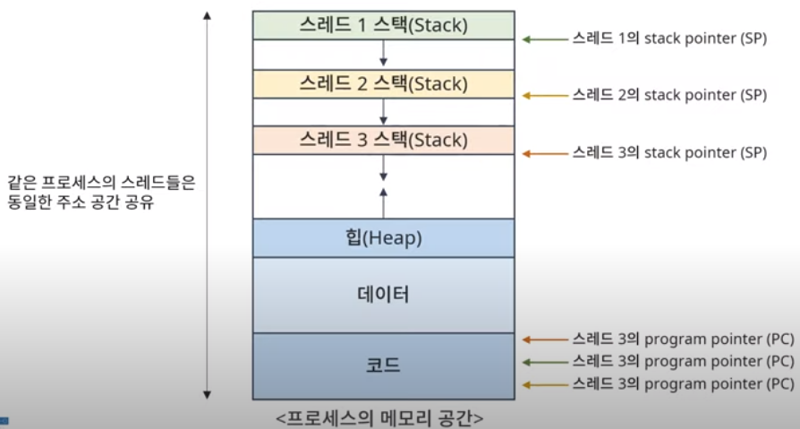
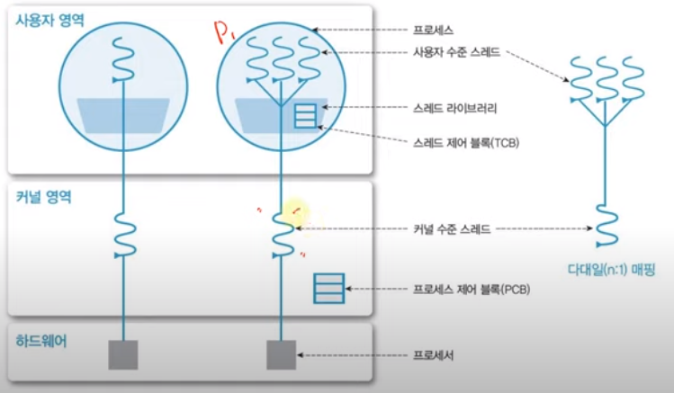
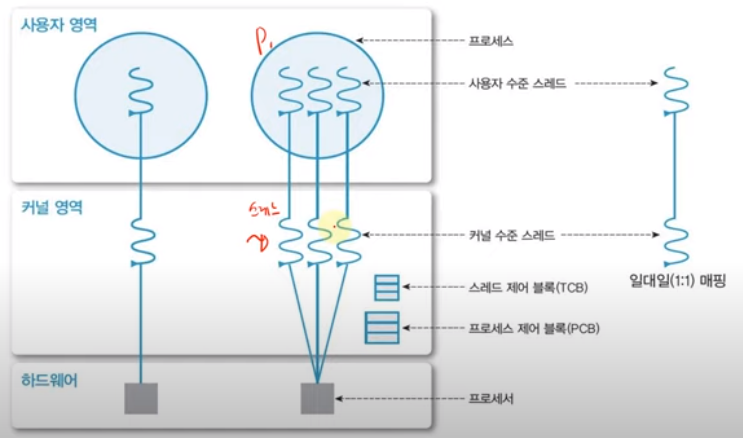
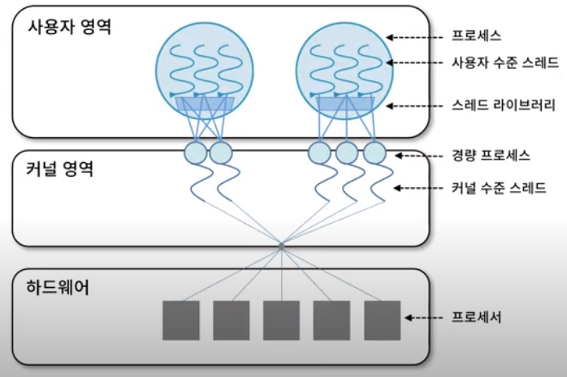

# Process Management

## Job vs. Process
- Job: 실행 할 프로그램 + 데이터를 의미하며 *실행 요청 전*의 상태다.
- Process: *실행을 위해 커널에 등록*된 작업이다.
 
실행을 위해 커널에 요청한 Job은 등록되어 메모리를 할당받으면 Processs로 올라간다.

### 프로세스의 종류
- 역할에 의한 구분
    - 시스템(커널) 프로세스: 모든 시스템 메모리와 CPU의 명령에 엑세스할 수 있는 프로세스
    - 사용자 프로세스: 사용자 코드를 수행하는 프로세스
- 병행 수행 방법
    - 독립 프로세스: 다른 프로세스에 영향을 주고 받지 않는 병행 프로세스
    - 협력 프로세스: 다른 프로세스에 영향을 주고 받는 병행 프로세스

## 자원
커널의 관리 하에 프로세스에게 할당/반납되는 수동적 개체이다. 하드웨어로는 메모리, 디스크 등이 있고 소프트웨어로는 메시지 등이 있다.

### process control block( PCB )
프로세스를 제어하기 위해 필요한 정보를 포함한다. 정보는 OS마다 다르며 OS 의 성능에 영향을 주는 요소이다.

[ 정보 ]  
- PID
- 스베줄링 정보
- 프로세스 상태
- 메모리 관리 정보
- context 저장 정보
등이 있다.

### Process State Transition Diagram

- Created State: Job을 커널에 등록된 상태이다. PCB 할당 및 프로세스를 생성하는데 커널에서 가용 메모리를 확인한다.
- Ready State: 가용 메모리가 존재하여 할당받게 된다. 프로세서 외의 다른 모든 자원을 할당 받은 상타로 CPU 할당을 대기한다. 
- Running State: 프로세서를 할당받아 필요한 모든 자원을 받은 상태다.
- Preemption: 프로세서가 뻇기는 상태로 프로세서 스케줄링에 따라 우선순위가 넘어간 경우가 있다.
- Block/sleep: I/O가 필요하여 데이터를 대기하는 상태로 Ready State로 넘어가 자원을 할당을 대기한다.
- Suspended State: 가용 메모리가 없는 상태로 메모리를 할당 받지 못한 경우(Suspended ready)나 메모리가 뺏긴 경우(Suspended blocked)이다. 
- Terminated/Zombie State: 프로세스 수행이 끝난 상태로 모든 자원 반납 후 PCB정보만 남아있다. 이 후 프로세스를 삭제한다.

## 인터럽트
*예상치 못한, 외부*에서 발생한 이벤트이다. 

- I/O Interrupt: 키보드나 마우스 클릭과 같은 외부 이벤트
- Clock Interrupt
- Console Interrupt
- Program check Interrupt
- .. 

### 처리 과정

1. Interrupt 발생
2. 커널이 개입해 프로세스 중단 -> Context saving이 발생 일종의 체크포인트로 현 상태를 PCBi에 저장한다.
3. Interrupt Handling
    3-1. 발생 장소 및 원인 파악
    3-2. Interrupt service 결정
    3-3. Interrupt service 루틴 호출 

4. ready state의 프로세스를 실행한다. 위의 그림에서는 PCBj가 Context를 복구하여 실행된다.

### Context Switching

#### Context
프로세스와 관련된 정보들의 집합
- CPU 레지스터 Context
- 메모리 Context 
로 구분된다.

위의 그림에서 Interrupt가 CPU에서 발생하여 CPU 레지스터 정보를 저장해야 한다.

#### Context saving
위의 레지스터 context는 PCB에 저장되어 메모리에 정보가 저장된다.

#### Context restoring
레지스터 context를 프로세스로 복구한다.

#### Context switching
실행 중인 프로세스를 바꾸는 작업으로 위의 그림에서 PCBi->PCBj로 context로 복구한다. 이는 커널의 개입으로 이루어진다.

[ Overhead ]
Context switch는 빈번하게 발생하여 비용이 소요된다. 불필요한 context switching을 피하는 것이 좋은데 이는 *스레드*를 활용하는 것이 좋다.

# Thread Management
프로세스에서 자원을 할당받는데 이를 제어하는 것을 스레드라고 한다.

- light weight process: 자원을 공유하고 *제어* 부분만 포함하여 가볍다.
- 프로세스 활용의 기본 단위 
- 구성요소 : Thread ID , PC, SP, Stack
- Resource를 공유하여 사용한다.

하나의 프로세스에서 여러개의 스레드가 존재할 수 있다.

- 코드: PC( 프로그램 카운터 )로 프로세스 어느 부분이 실행되는지 관리한다.
- 전역 데이터: input / output
- 힙: 프로세스가 사용하는 메모리로 전역적인 공간이다.

- 제어 정보: PC, Stack Pointer 등
- 지역 데이터: 반복문 안에서 사용된 변수 `i`와 같은 경우
- 스택: 지역 데이터가 저장된다.

### Single Thread
Thread가 하나인 경우이다.

### 장점
- 자원을 공유하여 멀티 쓰레드로 효율성을 증가시킬 수 있다.
- 프로세서를 여러 개 사용하면 Context Swtiching발생하여 커널이 개입해 overhaed가 발생한다. 하지만 쓰레드를 여러개 사용하면 Switching이 발생하지 않아 경제적이다.
- 사용자 응답성이 있다. 일부 스레드가 지연되어도 다른 스레드는 실행된다.

## 구현

### 사용자 수준 Thread

- 사용자 영역의 스레드 라이브러리로 구현된다. 
- 커널은 스레드의 존재를 알 수 없어 커널의 개입을 받지 않아 유연한 관리가 가능하다.
- 하지만 커널은 프로세스 단위로 자원을 할당하여 하나의 스레드가 block되면 모든 스레드가 대기하게 된다.

### 커널 수준 Thread

- 커널이 직접 관리하여 오버헤드가 크다. 
- 하지만 하나의 스레드가 block되어도 다른 스레드를 사용할 수 있는 이점이 있다.

### 혼합형 스레드

- 사용자 수준 Thread + 커널 수준 Thread
- 실제 OS 의 모델이다.

