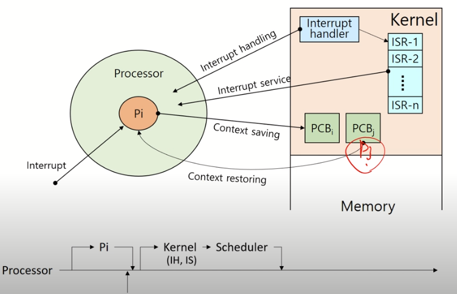
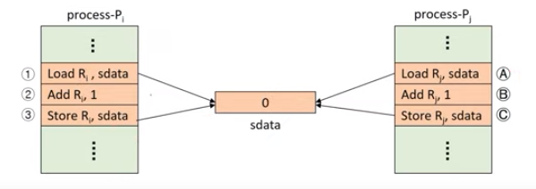
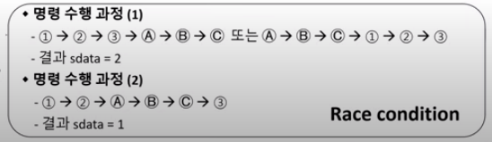
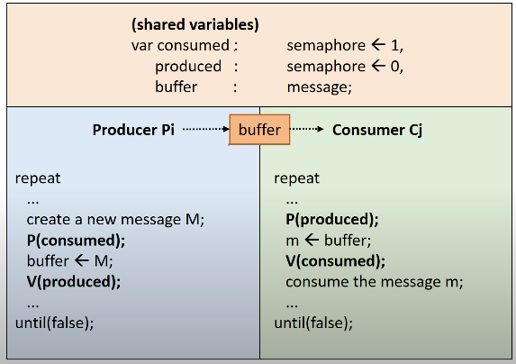
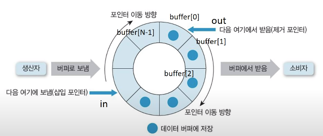

*<HPC Lab. KOREATECH김덕수> 교수님의 운영체제 강의를 듣고 정리한 공간*
# Process Management

## Job vs. Process
- Job: 실행 할 프로그램 + 데이터를 의미하며 *실행 요청 전*의 상태다.
- Process: *실행을 위해 커널에 등록*된 작업이다.
 
실행을 위해 커널에 요청한 Job은 등록되어 메모리를 할당받으면 Processs로 올라간다.

### 프로세스의 종류
- 역할에 의한 구분
    - 시스템(커널) 프로세스: 모든 시스템 메모리와 CPU의 명령에 엑세스할 수 있는 프로세스
    - 사용자 프로세스: 사용자 코드를 수행하는 프로세스
- 병행 수행 방법
    - 독립 프로세스: 다른 프로세스에 영향을 주고 받지 않는 병행 프로세스
    - 협력 프로세스: 다른 프로세스에 영향을 주고 받는 병행 프로세스

## 자원
커널의 관리 하에 프로세스에게 할당/반납되는 수동적 개체이다. 하드웨어로는 메모리, 디스크 등이 있고 소프트웨어로는 메시지 등이 있다.

### process control block( PCB )
프로세스를 제어하기 위해 필요한 정보를 포함한다. 정보는 OS마다 다르며 OS 의 성능에 영향을 주는 요소이다.

[ 정보 ]  
- PID
- 스베줄링 정보
- 프로세스 상태
- 메모리 관리 정보
- context 저장 정보
등이 있다.

### Process State Transition Diagram


- Created State: Job을 커널에 등록된 상태이다. PCB 할당 및 프로세스를 생성하는데 커널에서 가용 메모리를 확인한다.
- Ready State: 가용 메모리가 존재하여 할당받게 된다. 프로세서 외의 다른 모든 자원을 할당 받은 상타로 CPU 할당을 대기한다. 
- Running State: 프로세서를 할당받아 필요한 모든 자원을 받은 상태다.
- Preemption: 프로세서가 뻇기는 상태로 프로세서 스케줄링에 따라 우선순위가 넘어간 경우가 있다.
- Block/sleep: I/O가 필요하여 데이터를 대기하는 상태로 Ready State로 넘어가 자원을 할당을 대기한다.
- Suspended State: 가용 메모리가 없는 상태로 메모리를 할당 받지 못한 경우(Suspended ready)나 메모리가 뺏긴 경우(Suspended blocked)이다. 
- Terminated/Zombie State: 프로세스 수행이 끝난 상태로 모든 자원 반납 후 PCB정보만 남아있다. 이 후 프로세스를 삭제한다.

## 인터럽트
*예상치 못한, 외부*에서 발생한 이벤트이다. 

- I/O Interrupt: 키보드나 마우스 클릭과 같은 외부 이벤트
- Clock Interrupt
- Console Interrupt
- Program check Interrupt
- .. 

### 처리 과정



1. Interrupt 발생
2. 커널이 개입해 프로세스 중단 -> Context saving이 발생 일종의 체크포인트로 현 상태를 PCBi에 저장한다.
3. Interrupt Handling
    3-1. 발생 장소 및 원인 파악
    3-2. Interrupt service 결정
    3-3. Interrupt service 루틴 호출 

4. ready state의 프로세스를 실행한다. 위의 그림에서는 PCBj가 Context를 복구하여 실행된다.

### Context Switching

#### Context
프로세스와 관련된 정보들의 집합
- CPU 레지스터 Context
- 메모리 Context 
로 구분된다.

위의 그림에서 Interrupt가 CPU에서 발생하여 CPU 레지스터 정보를 저장해야 한다.

#### Context saving
위의 레지스터 context는 PCB에 저장되어 메모리에 정보가 저장된다.

#### Context restoring
레지스터 context를 프로세스로 복구한다.

#### Context switching
실행 중인 프로세스를 바꾸는 작업으로 위의 그림에서 PCBi->PCBj로 context로 복구한다. 이는 커널의 개입으로 이루어진다.

[ Overhead ]
Context switch는 빈번하게 발생하여 비용이 소요된다. 불필요한 context switching을 피하는 것이 좋은데 이는 *스레드*를 활용하는 것이 좋다.

# Process Scheduling

## 스케줄링
*다중 프로그래밍*이란 여러 개의 프로세스가 시스템 내 존재하는 것을 의미한다.스케줄링은 자원을 할당 할 프로세스를 선택한다. 

### 자원 관리
- 시간 분할 관리 : 하나의 자원을 여러 스레드가 번갈아 사용하는 것을 의미한다.
- 공간 분할 관리 : 하나의 자원을 동시에 사용한다.

### 목적 
시스템의 성능을 향상시키기 위함이다. 아래의 성능 지표 중에 목적에 맞는 것을 고려하여 스케줄링 기법을 선택한다.
- 응답시간 : interactive system
- 작업 처리량(throughput): 단위 시간동안 완료된 작업 수, batch system
- 자원 활용도: 자원이 활용된 시간의 정도

### 기준
#### 프로세스의 특성
프로세스 수행은  CPU 사용 + I/O 대기로 이루어진다. 
- compute-bounded: CPU burst가 더 많은 경우
- I/O-bounded: I/O burst가 더 많은 경우

#### 시스템 특성
#### 프로세스의 긴급성
#### 프로세스의 우선순위

### 단계
발생하는 빈도 및 할당 자원에 따른 구분된다.
#### long-term scheduling
- Job scheduling
- Job -> created: 시스템에 등록할 Job을 결정하는 스케줄링
- 다중 프로그래밍 정도( 시스템 내 프로세스 수 조절)을 조절한다. 

#### mid-term scheduling
- 메모리 할당을 결정한다. 
- suspended ready -> ready로 넘어가는 swap-in에서 자주 발생한다.
- swapping( swap-in/ swap-out) 

#### short-term scheduling
- 프로세스 스케줄링: CPU를 할당하는 경우
- ready -> running로 넘어가는 dispatch에서 자주 발생한다.
- 가장 빈번하게 발생하여 매우 빨라야 한다.

### 정책

#### 선점 vs. 비선점 스케줄링
- Non-preemptive scheduling: 할당 받을 자원을 스스로 반납할 때까지 사용한다.
- Preemptive scheduling: 자원을 빼앗길 수 있다. 실시간 시스템에 적합하나 context switch overhead가 크다.

#### Priority
프로세스의 우선순위를 정한다.
- Static  Priority: 프로세스 생성시 결정된 우선순위가 유지된다.
- Dynamic Priority: 프로세스의 상태 변화에 따라 우선순위가 변경한다.

## 스케줄링 알고리즘

### FCFS( First Come First Service )
- 먼저 오는 프로세스를 할당한다.
- Non-preemptive scheduling
- 기준: 도착 시간( ready queue )
- 자원에 활용도가 높다: 스케줄링 overhead가 높고 CPU가 계속 가동된다.
- Batch system에 적합하다: 오는 순서대로 빠르게 처리할 때 유용하기 때문
- 평균 응답시간이 길기 때문에 interactive system에 부적합하다.
- 수행시간이 긴 프로세스 때문에 그 뒤에 실행될 프로세스의 대기시간이 길어진다( Convoy effect )

### RR( Round Robin )
- 돌아가면서 프로세서를 사용한다.
- Preemptive scheduling
- 기준: 도착 시간( ready queue )
- 자원 사용에 제한 시간( time quantum )이 있다.: 할당된 시간이 지나면 자원을 반납시켜 자원 독점을 방지한다.
- context switch overhead가 크다.
- interactive, time-sharing 시스템에 적합하다.
- time quantum이 성능을 결정한다. 

### SPN( Shortest Process Next )
- 실행 시간(Burst time)이 가장 작은 프로세스들 먼저 처리한다.
- Non-preemptive scheduling
- 평균 대기시간이 최소화되, 시스템 내 프로세스 수 최소화된다.
- 무한대기( Starvation )현상이 발생한다.
- 정확한 실행시간이 필요하여 실행시간 예측 기법이 필요하다.

### SRTN( Shortest Remaining Process Next )
- SPN -> 남은 시간이 적은 프로세스를 먼저 처라한다.
- Preemptive scheduling: 잔여 실행 시간이 더 적은 프로세스가 ready가 되면 선점된다.
- SPN 장점 극대화
- 총 실행시간에 더해 잔여 실행을 계속 추적해야 해서 사용하기에는 비현실적이다.

### HRRN( High-Response-Ratio-Next )
- SPN + Aging concepts
- Non-preemptive scheduling
- Aging concepts: 프로세스의 대기 시간을 고려한다.
- 기준: response ratio가 높은 프로세스가 우선된다.
- response ratio = (WT+BT)/BT으로, 실행시간 대비 대기 시간+실행시간
- 정확한 실행시간이 필요하여 실행시간 예측 기법이 필요하다.

### MLQ( Multi-Level Queue )
- 작업별 별도의 ready queue를 가진다: 최초 배정된 queue가 고정된다.
- queue사이에 우선순위를 가진다.
- queue관리에 대한 스케줄링 overhead가 있고 우선순위가 낮은 경우 무한대기가 발생할 수 있다.

### MFQ( Multi-Level Feedback Queue )
- queue간 이동이 허용된다: feedback을 통해 우선 순위가 조정된다.

# Prcoess Synchronization and Mutual Exclusion
동기화란 프로세스들이 서로 정보를 공유하여 동작을 맞추는 것을 의미한다.
병행 수행중인 비동기적 프로세스들이 공유자원에 동시 접근할 때 문제가 발생하므로 동기화가 필요하다.

- Shared Data: 여러 프로세스가 공유하는 데이터
- Critical Section: 공유 데이터를 접근하는 코드 영역
- Mutual Exclusion: 둘 이상의 프로세스가 동시에 Critical Section에 진입하는 것을 방지한다.

## Critical Section
- 각 프로세스에서 공유 데이터를 접근하는 프로그램 코드 부분을 의미한다.
- Machine Instruction: Atomicity, Indivisible의 특징으로 한 기계어 명령의 실행 도중에는 인터럽트 받지 않는다.



1,2,3,A,B,C은  Machine Instruction로 인해 개입될 수 없다. 1,2,3,A,B,C은 각각 끝날때 preemption이 발생할 수 있는데 순서에 따라 다른 결과가 나올 수 있다.



Race condition은 동시에 여러 프로세스가 동일한 자료를 접근할 때 접근 순서에 따라 다양하게 변할 수 있음을 의미한다.

## Mutual Exclusion
프로세스가 Critical Section가 있을 때 다른 프로세스가 진입하는 것을 막는다. 동기화를 위해 공유되는 변수를 한 프로세스가 사용 중일 때, 변수 이용이 끝나기 전까지 다른 프로세스가 사용하는 것을 막아준다.

### Mutual Exclusion Primitives( 기본연산 )
- enterCS() primitive:Critical Section진입 전 검사
- exitCS() primitive: Critical Section 벗어날때의 후처리 과정

### Mutual Exclusion Primitives 요구
- Mutual Exclusion
- Progress( 진행 ): Critical Section안에 있는 프로세스 외에는 다른 프로세스가 진입하는 것을 방해하지 않는다.
- Bounded waiting( 한정대기 ): Critical Section에 대한 진입 요청이 있을 때, 무한 대기 없이 진입할 수 있어야 한다.

## SW Algorithm

### Dekker's Algorithm
- Two process Mutual Exclusion을 보장하는 최초의 알고리즘
- `flag`: 프로세스 중 누가 임계 구역에 진입할지에 대한 변수
- `turn`: 누가 임계 영역에 들어갈 차레인지에 대한 변수

```sh
f0 ← false
f1 ← false
turn ← 0   // or 1

 p0:                                 p1:
     f0 ← true                         f1 ← true
     # f1이 진입한 상태 -> 대기          # f0이 진입한 상태  -> 대기
     while f1 {                         while f0 {
         if turn ≠ 0 {                      if turn ≠ 1 {
             f0 ← false                         f1 ← false
             while turn ≠ 0 {                  while turn ≠ 1 {
             }                                   }
             f0 ← true                          f1 ← true
         }                                   }
     }                                    }

    // 임계 구역                          // 임계 구역 
    ...                                   ...
    // 나머지 구역                        // 나머지 구역
   turn ← 1                             turn ← 0
   f0 ← false                           f1 ← false
```
출처: https://ko.wikipedia.org/wiki/%EB%8D%B0%EC%BB%A4%EC%9D%98_%EC%95%8C%EA%B3%A0%EB%A6%AC%EC%A6%98

#### Dijkstra Algorithm

## HW Algorithm

### TestAndSet( TAS ) instruction
busy waiting의 문제가 있다.

## OS supported SW Algorithm
### Spinlock
- 정수 변수
- 초기화, P(), V() 연산으로만 접근 가능
    - P() : Lock 개념의 연산
    - V() : Unlock 개념의 연산

멀티 프로세서 시스템에서만 사용 가능
Busy waiting

### Semaphore
- Busy waiting 문제 해결
- 음이 아닌 정수형 변수(S)
    - 초기화 연산, P(), V()로만 접근
- 임의의 S 변수 하나에 ready queue하나가 할당된다.

#### Binary Semaphore
- S가 0, 1 두 종류의 값만 갖는 경우
- 상호 배제나 프로세스 동기화의 목적으로 사용

#### Counting Semaphore
- S가 0 이상의 정수값을 가질 수 있는 경우
- Producer-Consumer 문제 등을 해결하기 위해 사용

```sh
function V(semaphore S, integer I):
    [S ← S + I]

function P(semaphore S, integer I):
    repeat:
        [if S ≥ I:
        S ← S − I
        break]
```
출처: https://en.wikipedia.org/wiki/Semaphore_(programming)
#### 문제 해결
[ Mutual Exclusion ]

[ Process synchoronization ]
- Process 들의 실행 순서 맞추기

[ Producer-Consumer ]

- Producer-Consumer problem with single buffer



- Producer-Consumer problem with N-buffers




# Prcoess Synchronization and Mutual Exclusion
동기화란 프로세스들이 서로 정보를 공유하여 동작을 맞추는 것을 의미한다.
병행 수행중인 비동기적 프로세스들이 공유자원에 동시 접근할 때 문제가 발생하므로 동기화가 필요하다.

- Shared Data: 여러 프로세스가 공유하는 데이터
- Critical Section: 공유 데이터를 접근하는 코드 영역
- Mutual Exclusion: 둘 이상의 프로세스가 동시에 Critical Section에 진입하는 것을 방지한다.

## Critical Section
- 각 프로세스에서 공유 데이터를 접근하는 프로그램 코드 부분을 의미한다.
- Machine Instruction: Atomicity, Indivisible의 특징으로 한 기계어 명령의 실행 도중에는 인터럽트 받지 않는다.


1,2,3,A,B,C은  Machine Instruction로 인해 개입될 수 없다. 1,2,3,A,B,C은 각각 끝날때 preemption이 발생할 수 있는데 순서에 따라 다른 결과가 나올 수 있다.


Race condition은 동시에 여러 프로세스가 동일한 자료를 접근할 때 접근 순서에 따라 다양하게 변할 수 있음을 의미한다.

## Mutual Exclusion
프로세스가 Critical Section가 있을 때 다른 프로세스가 진입하는 것을 막는다. 동기화를 위해 공유되는 변수를 한 프로세스가 사용 중일 때, 변수 이용이 끝나기 전까지 다른 프로세스가 사용하는 것을 막아준다.

### Mutual Exclusion Primitives( 기본연산 )
- enterCS() primitive:Critical Section진입 전 검사
- exitCS() primitive: Critical Section 벗어날때의 후처리 과정

### Mutual Exclusion Primitives 요구
- Mutual Exclusion
- Progress( 진행 ): Critical Section안에 있는 프로세스 외에는 다른 프로세스가 진입하는 것을 방해하지 않는다.
- Bounded waiting( 한정대기 ): Critical Section에 대한 진입 요청이 있을 때, 무한 대기 없이 진입할 수 있어야 한다.

## SW Algorithm

### Dekker's Algorithm
- Two process Mutual Exclusion을 보장하는 최초의 알고리즘
- `flag`: 프로세스 중 누가 임계 구역에 진입할지에 대한 변수
- `turn`: 누가 임계 영역에 들어갈 차레인지에 대한 변수

```sh
f0 ← false
f1 ← false
turn ← 0   // or 1

 p0:                                 p1:
     f0 ← true                         f1 ← true
     # f1이 진입한 상태 -> 대기          # f0이 진입한 상태  -> 대기
     while f1 {                         while f0 {
         if turn ≠ 0 {                      if turn ≠ 1 {
             f0 ← false                         f1 ← false
             while turn ≠ 0 {                  while turn ≠ 1 {
             }                                   }
             f0 ← true                          f1 ← true
         }                                   }
     }                                    }

    // 임계 구역                          // 임계 구역 
    ...                                   ...
    // 나머지 구역                        // 나머지 구역
   turn ← 1                             turn ← 0
   f0 ← false                           f1 ← false
```
출처: https://ko.wikipedia.org/wiki/%EB%8D%B0%EC%BB%A4%EC%9D%98_%EC%95%8C%EA%B3%A0%EB%A6%AC%EC%A6%98

#### Dijkstra Algorithm

## HW Algorithm

### TestAndSet( TAS ) instruction
busy waiting의 문제가 있다.

## OS supported SW Algorithm
### Spinlock
- 정수 변수
- 초기화, P(), V() 연산으로만 접근 가능
    - P() : Lock 개념의 연산
    - V() : Unlock 개념의 연산

멀티 프로세서 시스템에서만 사용 가능
Busy waiting

### Semaphore
- Busy waiting 문제 해결
- 음이 아닌 정수형 변수(S)
    - 초기화 연산, P(), V()로만 접근
- 임의의 S 변수 하나에 ready queue하나가 할당된다.

#### Binary Semaphore
- S가 0, 1 두 종류의 값만 갖는 경우
- 상호 배제나 프로세스 동기화의 목적으로 사용

#### Counting Semaphore
- S가 0 이상의 정수값을 가질 수 있는 경우
- Producer-Consumer 문제 등을 해결하기 위해 사용

```sh
function V(semaphore S, integer I):
    [S ← S + I]

function P(semaphore S, integer I):
    repeat:
        [if S ≥ I:
        S ← S − I
        break]
```
출처: https://en.wikipedia.org/wiki/Semaphore_(programming)
#### 문제 해결
[ Mutual Exclusion ]

[ Process synchoronization ]
- Process 들의 실행 순서 맞추기

[ Producer-Consumer ]

- Producer-Consumer problem with single buffer


- Producer-Consumer problem with N-buffers


