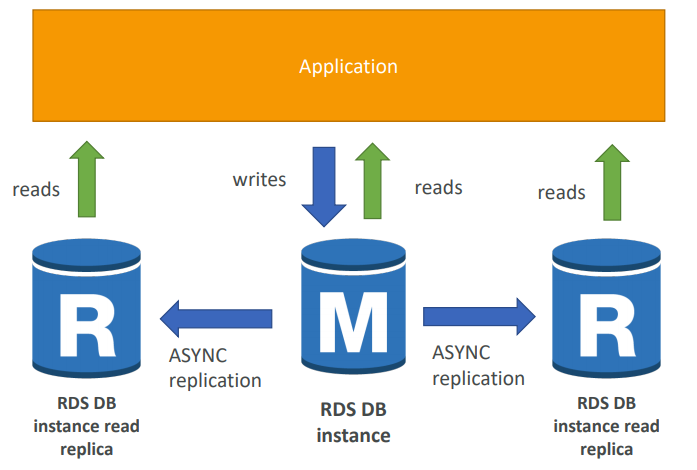
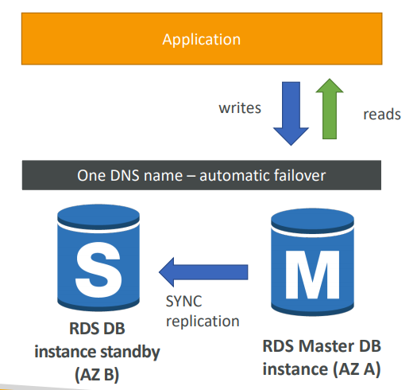
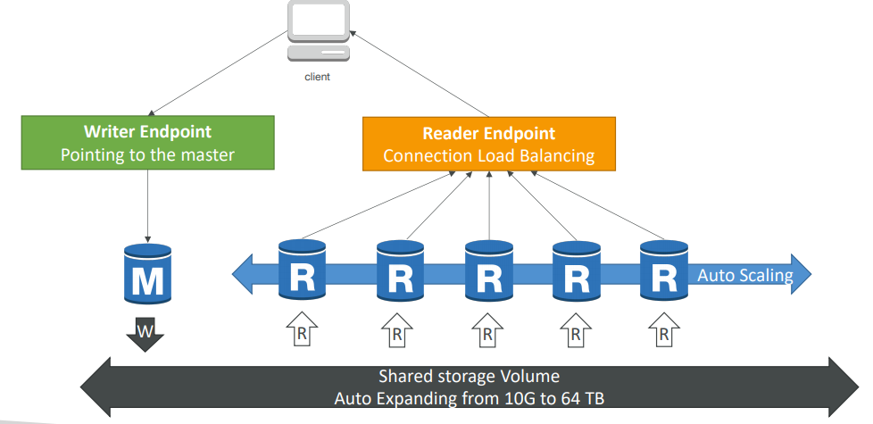
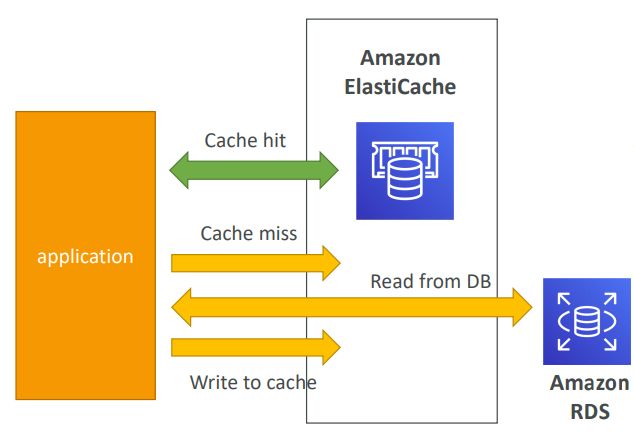
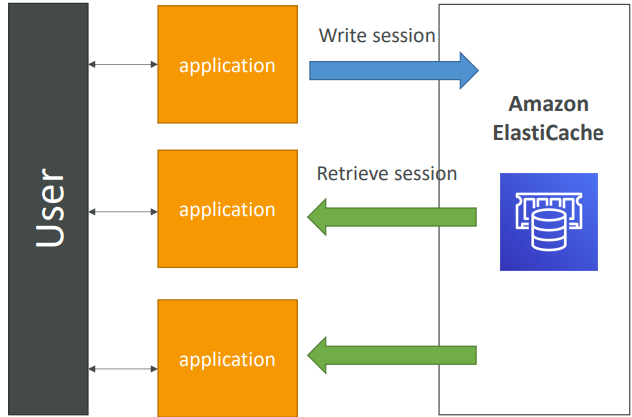

# RDS + Aurora + ElasticCache [ Udemy ]

## RDS
RDS is Relational Database Serive., managed DB service for DB use SQL as query

### EC2 인스턴스에 DB 배포하는 경우와 비교하여 
- automated provisioning, OS patching
- 지속적으로 백업을 유지하고 복구( point-in-time )
- 모니터링 대시보드 제공
- read replicas 더 좋은 성능을 제공
- DR( Disaster Recovery )에 여러 AZ 설정
- 업그레이드 유지보수
- capability 스케일링
- EBS에 의해 스토리지 백업 가능

### Backups
- 자동 백업
- 스토리지 자동 스케일링 : 최대 스토리지 threshold를 설정해줘야 함
- unpredicted workloads에 유용함

### read scalability
- read replicas 5개까지 가능
- Replication - ASYNC하므로 reads가 일관성을 유지할 수 있음

- read replicas는 SELECT과 같은 read만을 위해 사용됨
### Network Cost
다른 AZ의 read replicas는 비용이 소요되나 같은 region은 비용이 발생하지 않음

### Multi AZ( Disaster Recovery )

- SYNC replication
- availability 증가
- 하나의 DNS name을 사용
#### Single AZ -> Multi AZ
- zero downtime operation(DB를 멈출 필요가 없음)
- 내부적으로 snapshot을 생성하여 복구할 수 있음( synchronization )

### Security 

#### Encryption
- At rest Encryption 
    - AWS KMS - AES-256 encryption로 암호화 가능
    - master가 암호화되어있지 않으면 read replicas도 암호화 불가
- In-flight Encryption 

#### Network & IAM
- Network Security : RDS는 주로 private subnet에서만 배포, security group 관리
- Access Security : IAM policies로 관리

#### IAM authentication
- MySQL, PostgreSQL에 작동
- 비밀번호 필요없이 IAM & RDS API call로 token 획득 가능

## Aurora
- PostgreSQL, MySQL 지원 가능
- Aurora는 AWS cloud에 최적화된 RDB
- HA native라 failover에 즉각 반응
- 20%정도 더 비싸지만 효율적

### High availability & Read Scaling
- master에서만 writes를 받음
- failover에 대한 반응이 30초 안 걸림
- master + 최대 15개까지의 aurora read replicas가 reads 감당함
- cross region replication

### Security
- RDS와 유사
    - KMS로 Encryption at rest
    - SSL로 Encryption in fligh
    - IAM token으로 인증 가능

### auto scaling
### custom endpoints
aurora instances의 일부를 custom endpoints를 적용 가능
### serverless
### Multi-Master
write node에 대한 즉각적인 failover를 원하는 경우

## ElastiCache
- 완전관리형 Redis, Memcached를 위한 서비스로 in-memory database 캐쉬로 사용함( low latency )
- database 로드를 줄여줌
- lazy loading 
- write through : cache에 데이터를 추가하거나 업데이트
- session store: 일시적인 session 데이터를 저장

### DB cache

- ElastiCache에 저장되지 않았으면 RDS에서 가져옴
- RDS의 로드를 
- 가장 최신의 데이터가 반영되어 있어야 함

- application logs : session 데이터를 ElastiCache에 저장
- 이미 로그인된 유저에 대한 데이터를 바로 가져올 수 있음

### Redis
- auto-failover에 대한 multi AZ
- 높은 가용성 : reads replicas 이용
- AOF 유지로 데이터 지속성
- 백업 및 복구

### Memcached
- 샤딩 : multi node로 파티셔닝
- 높은 가용성은 없음
- 데이터 지속성이 없음
- 백업 및 복구 없음

### Security
- IAM 인증 안됨
- Redist AUTH : redis cluster에 대한 password/token 설정 가능
- memcached : SASL-based 인증 지원