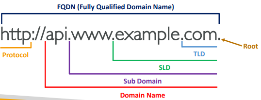

# Route 53

## DNS
machine IP주소를 human friendly hostname으로 변경해줌

- TLD(Top Level Domain)
- SLD(Second Level Domain)

## Route 53
high available, scalable, full managed, authoritative DNS이다.

### Record Types
- A : IPv4에 매핑
- AAAA : IPv6에 매핑
- CNAME : 다른 hostname에 매핑
- NS : hosted zone에 name servers

