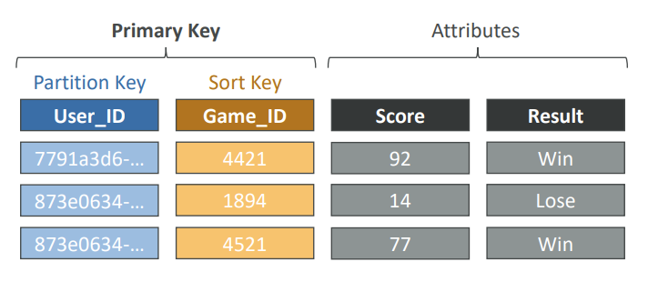

# Serverless
서비리스는 서버를 관리할 필요없이 서비스를 Function으로 배포한다.
AWS에서는 AWS Lambda, DynamoDB, AWS API Gateway, Amazon S3 등이 있다.

## DynamoDB

**[특징]**
- NoSQL 데이터베이스
- 분산 및 scaling이 가능하다.
- replication을 통한 높은 가용성, fully managed
    - fully managed : 내부적으로 서버/OS가 있지만 사용자에게 드러나지 않으며 DB 또한 설치할 필요가 없다. 
- fast, 성능에서 일관성이 있다.
- low cost, auto-scaling

**[구조]**
- Tables로 구성되어 있다.
- 각 Table은 
    - Primary Key가 있다.   
    - 무한한 items(rows)를 가질 수 있다.
        - 각 item은 attributes가 있고 최대 400KB까지 가능하다.
- Data Types
    - Scalar Types : String, Number, Binary, Boolean, Null
    - Document Types: List, Map
    - Set Types: String Set, Number Set, Binary Set

**[Capacity Modes]**
read/write throughput에 따라 요금이 다르다.
- Provisioned Mode
    - capacity를 미리 계획
    - provisioned Read Capacity Units(RCU), Write Capacity Unites(WCU)만큼 지불한다.
    -  RCU & WCU에서 auto-scaling
- On-Demand Mode
    - 사용한만큼 지불
    - 예측할 수 없는 workloads일 때 사용하며 2-3배 더 비싸다.

### DynamoDB Accelerator(DAX)

## Lambda
**[Serverless CRON]**
ex. CloudWatch를 통해 이벤트 발생을 탐지하고 AWS Lambda function에서 처리하도록 한다.