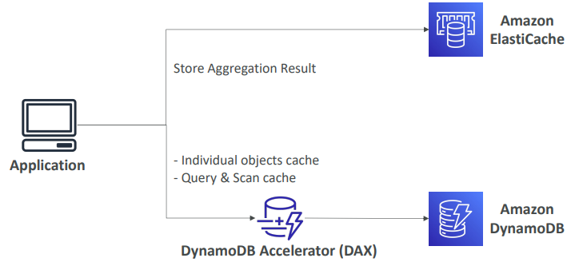
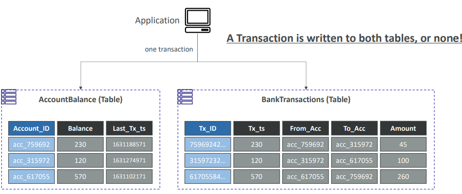
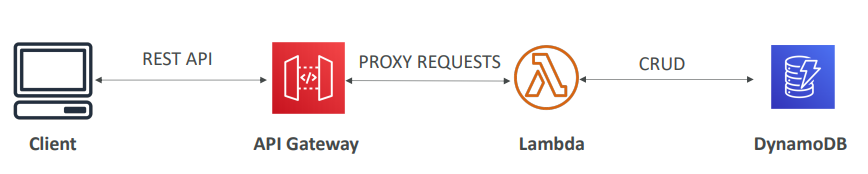

# Serverless
서비리스는 서버를 관리할 필요없이 서비스를 Function으로 배포한다.
AWS에서는 AWS Lambda, DynamoDB, AWS API Gateway, Amazon S3 등이 있다.

- code / functions만 배포하면 된다
- FaaS( Function as a Service )
- No Server가 아니라 manage, provision할 필요가 없다는 의미

## Lambda 
### vs. EC2
- EC2 : virtual cloud / RAM, CPU에 제한 / 계속 실행됨 / 스케일링 직접 해야
- Lambda : virtual functions / 짧은 실행 / on-demand / 자동 스케일링
### Limits
- 메모리 할당 : 128MB - 10GB
- 최대 실행시간 : 900초
- 디스크 : 512MB
- 동시성 실행 : 1000
### Lambda@Edge
- CloudFront로 CDN을 배포할 수 있음
- ex. website security / SEO / dynamic web application

## DynamoDB

**[특징]**
- NoSQL 데이터베이스
- 분산 및 scaling이 가능하다.
- replication을 통한 높은 가용성, fully managed, 여러 AZ에 replicate 가능
    - fully managed : 내부적으로 서버/OS가 있지만 사용자에게 드러나지 않으며 DB 또한 설치할 필요가 없다. 
- fast, 성능에서 일관성이 있다.
- low cost, auto-scaling

**[구조]**
- Tables로 구성되어 있다.
- 각 Table은 
    - Primary Key가 있다.   
    - 무한한 items(rows)를 가질 수 있다.
        - 각 item은 attributes가 있고 최대 400KB까지 가능하다.
- Data Types
    - Scalar Types : String, Number, Binary, Boolean, Null
    - Document Types: List, Map
    - Set Types: String Set, Number Set, Binary Set

**[Capacity Modes]**
read/write throughput에 따라 요금이 다르다.
- Provisioned Mode
    - capacity를 미리 계획
    - provisioned Read Capacity Units(RCU), Write Capacity Unites(WCU)만큼 지불한다.
    -  RCU & WCU에서 auto-scaling
- On-Demand Mode
    - 사용한만큼 지불
    - 예측할 수 없는 workloads일 때 사용하며 2-3배 더 비싸다.

### DynamoDB Accelerator(DAX)
DynamoDB를 위한 full-managed, high availalbe, seamless 인메모리 캐시이다.
- caching으로 read 성능 개선
#### vs. ElastiCache

### DynamoDB Streams
Stream Records
- send to Kinesis Data Streams
- read by AWS Lambda
- read by Kinesis Client Library applications

### Global Tables
- low latency in multiple regions
- 어느 region에서든 READ / WRITE 

### TTL( TIme To Live)
만료일자 지나면 자동으로 items 삭제

### Indexes
Global Secondary Indexes(GSI) & Local Secondary Indexes(LSI)

### Transactions

## API Gateway
- ex. AWS Step Function workflow, SQS에 메per reg시지 전송

### Serverless API

### Endpoint Types
- Edge-Optimized : 
- Regional : 같은 region내에 한함
- Private : VPC 내에서 endpoint 접근

### Security
- IAM permissions : IAM policy authorization 생성
- Lambda authorizer
- cognito user pools : authorization이 아닌 authentication에만 적용

## AWS Cognito
- Cognito User pools
- Cognito Identity pools
- Cognito Sync
