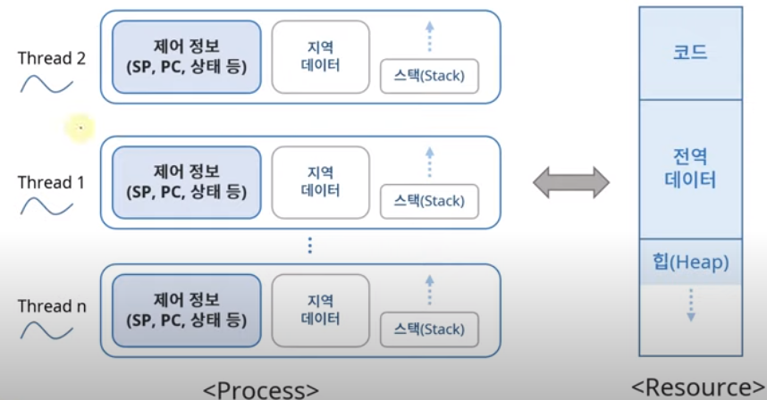
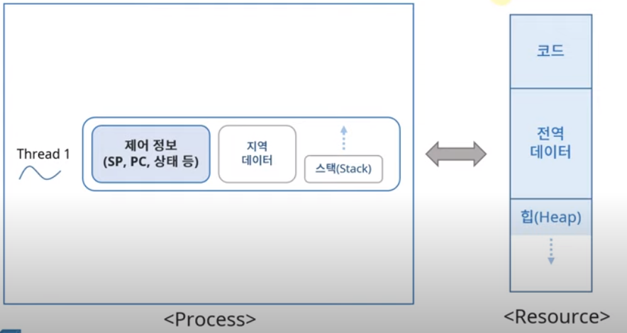
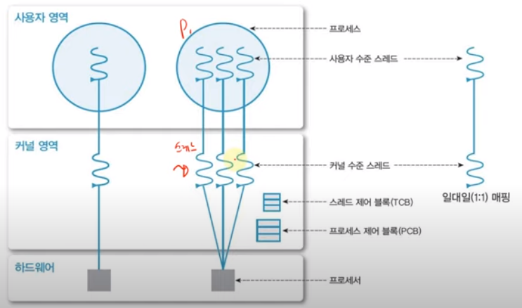
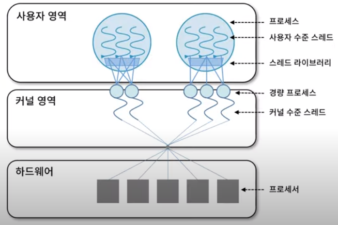

*<HPC Lab. KOREATECH김덕수> 교수님의 운영체제 강의를 듣고 정리한 공간*
# Thread Management
프로세스에서 자원을 할당받는데 이를 제어하는 것을 스레드라고 한다.

- light weight process: 자원을 공유하고 *제어* 부분만 포함하여 가볍다.
- 프로세스 활용의 기본 단위 
- 구성요소 : Thread ID , PC, SP, Stack
- Resource를 공유하여 사용한다.

하나의 프로세스에서 여러개의 스레드가 존재할 수 있다.

- 코드: PC( 프로그램 카운터 )로 프로세스 어느 부분이 실행되는지 관리한다.
- 전역 데이터: input / output
- 힙: 프로세스가 사용하는 메모리로 전역적인 공간이다.

- 제어 정보: PC, Stack Pointer 등
- 지역 데이터: 반복문 안에서 사용된 변수 `i`와 같은 경우
- 스택: 지역 데이터가 저장된다.

### Single Thread
Thread가 하나인 경우이다.

### 장점
- 자원을 공유하여 멀티 쓰레드로 효율성을 증가시킬 수 있다.
- 프로세서를 여러 개 사용하면 Context Swtiching발생하여 커널이 개입해 overhaed가 발생한다. 하지만 쓰레드를 여러개 사용하면 Switching이 발생하지 않아 경제적이다.
- 사용자 응답성이 있다. 일부 스레드가 지연되어도 다른 스레드는 실행된다.

## 구현

### 사용자 수준 Thread

- 사용자 영역의 스레드 라이브러리로 구현된다. 
- 커널은 스레드의 존재를 알 수 없어 커널의 개입을 받지 않아 유연한 관리가 가능하다.
- 하지만 커널은 프로세스 단위로 자원을 할당하여 하나의 스레드가 block되면 모든 스레드가 대기하게 된다.

### 커널 수준 Thread

- 커널이 직접 관리하여 오버헤드가 크다. 
- 하지만 하나의 스레드가 block되어도 다른 스레드를 사용할 수 있는 이점이 있다.

### 혼합형 스레드

- 사용자 수준 Thread + 커널 수준 Thread
- 실제 OS 의 모델이다.

