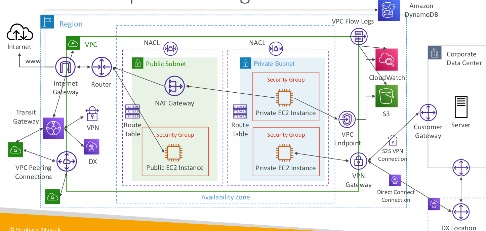

# VPC

## CIDR - IPv4

### Subnet Mask
IP에서 얼마나 많은 bits를 정의할 수 있는지

VPC는 private이기에 Private IPv5 ranges만 가능하다.

## Internet Gateway
- VPC와 독립적으로 생성된다.
- 하나의 VPC는 하나의 Internet Gateway와 연동된다.
- 자체로는 internet에 접근할 수 없고 라우트 테이블이 필요하다.

## Bastion Hosts

- private EC2 인스턴스에 접속할 때 사용한다.
- bastion은 public subnet 안에 존재하고 다른 private subnet내부에 연결된다.

## NAT 
NAT = Network Address Translation

### NAT Instance
- outdated
- private subnet 안의 EC2 인스턴스가 인터넷에 연결될 수 있도록 한다.
- public subnet에서 시작되어야 한다.
- EC2 설정에서 Source/ destination Check를 비활성화시켜야 한다.
- EIP를 할당시켜야 한다.
- Route Table이 private subnet에 대해 설정되어 있어야 한다.

### NAT Gateway
- AWS-managed NAT로, bandwidth, availability가 높다.
- 시간당 usage, bandwidth마다 청구된다.
- EIP를 할당시키고, 특정 AZ에 사용된다.
- 같은 subnet에서 사용될 수 없다.
- Internet Gateway가 필요한데,  private subnet -> NATGW -> IGW로 작동한다.

