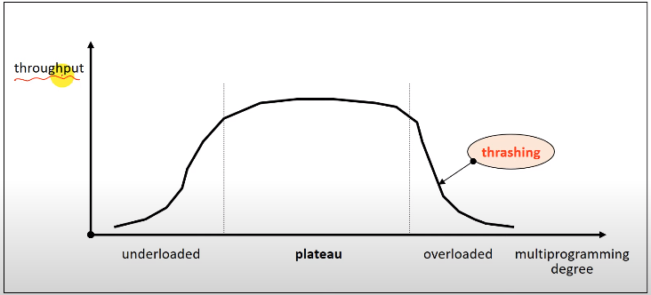

*<HPC Lab. KOREATECH김덕수> 교수님의 운영체제 강의를 듣고 정리한 공간*
# Virtual Memory Management

가상 메모리는 사용자 프로그램을 block단위로 분할한 non-continuous allocation이다.

## Cost Model
- page fault frequency
- page fault rate

page fault rate를 최소화할 수 있도록 전략을 설계해야 한다.

### page reference string
프로세스의 수행 중 참조한 페이지 번호의 순서이다. 효율적인 관리의 기준으로 사용된다.

## Hardware Components
### Address translation device
주소 사상을 효율적으로 수행하기 위한 것으로 TLB가 있다.

### Bit Vectors
Page 사용 상황에 대한 정보를 기록하는 비트이다.
- Reference bits: 참조 비트
- Update bits: 갱신 비트

#### Reference bit vector
메모리에 적재된 page가 최근에 참조되었는지 표시한다.
- 프로세스에 의해 참조되면 page의 reference bit를 1로 설정
- 주기적으로 모든 reference bit를 0으로 초기화

reference bit를 통해 최근에 참조된 page를 확인할 수 있다.

#### Update bit vector
page가 메모리에 적재된 후 프로세스에 의해 수정되었는지를 표시한다.
- Update bit = 1: 해당 page의 메인 메모리 상 내용과 swap device의 내용이 다르므로 page에 대한 write-back이 필요하다는 것을 의미한다.

## Software Components
### Allocation 전략
메모리를 얼마만큼 줄 것인가에 관한 문제이다.
- Fixed allocation: 프로세스의 실행 동안 고정된 크기의 메모리 할당한다.
- Variable allocation: 프로세스의 실행 동안 할당하는 메모리 크기가 유동적이다.

메모리 할당이 너무 크면 낭비되고 너무 작으면 page fault가 발생하여 성능이 저하된다.

### Fetch 전략
특정 page를 메모리에 언제 적재할 것인가에 대한 문제이다.
- Demand fetch: 프로세스가 참조하는 페이지들만 적재한다.
- Anticipatory fetch(pre-paging): 참조될 가능성이 높은 page를 예측하여 미리 적재하다. 예측 성공하면 page fault overhead가 없으나 prediction overhead가 있다.

대부분의 OS는 Demand fetch를 사용한다.

### Placement 전략
page/segment를 어디에 적재할 것인가에 대한 문제이다.

### Replacement 전략
새로운 page를 어떤 page와 교체할 것인가에 대한 문제이다.

#### Locality

### Cleaning 전략
변경된 page를 언제 swap device에 write-back할 것인가에 대한 문제이다.
- Demand cleaning: 해당 page에 메모리에서 가져올 때 write-back
- Anticipatory cleaning: 더 이상 변경될 가능성이 없다고 판단하면 미리 write-back.

 대부분의 OS는 Demand cleaning기법을 사용한다.

### Load Control 전략
시스템의 multi-programming degres를 조절한다. 저부하나 고부하 상태를 피하기 위해 적정 수준으로 유지해야 한다.

- thrashing: 과도한 page fault가 발생하는 경우로 과부하 상태이다.