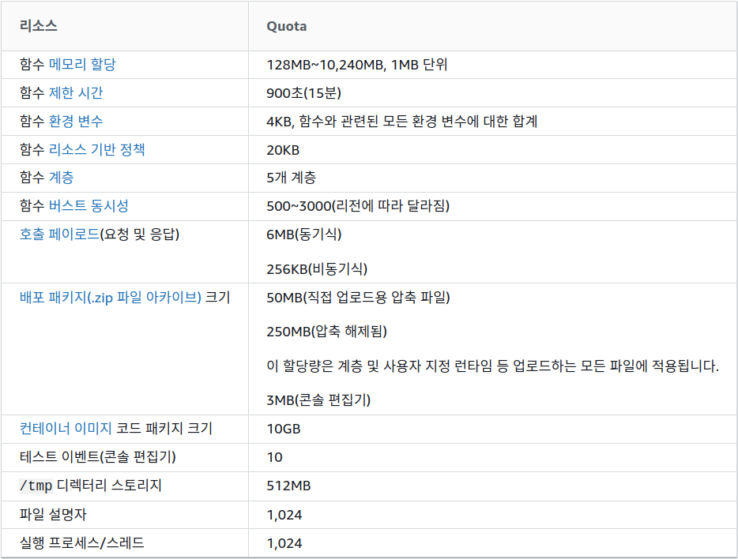
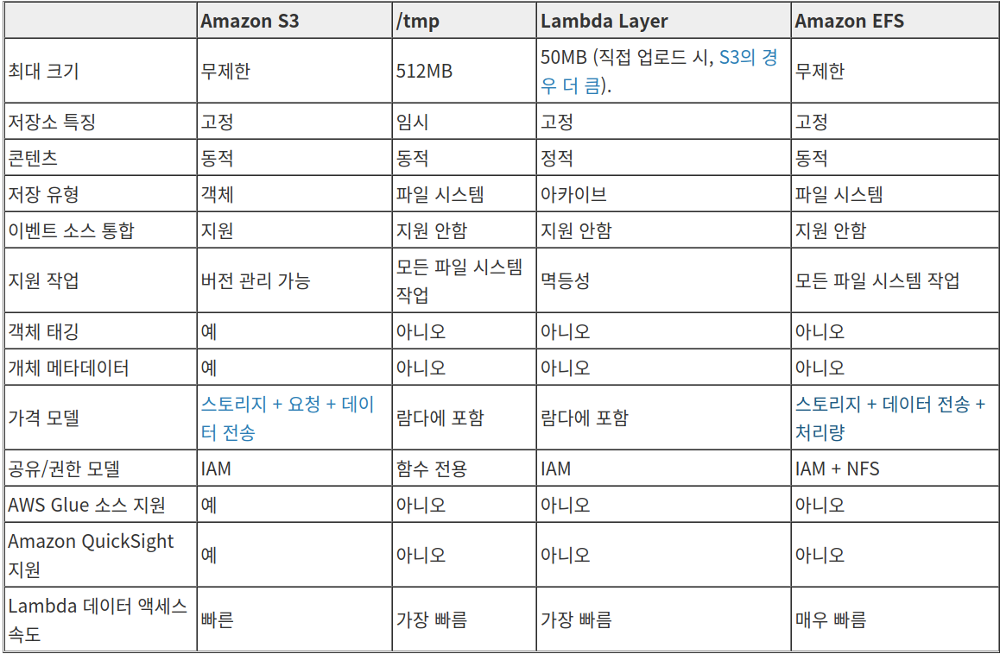
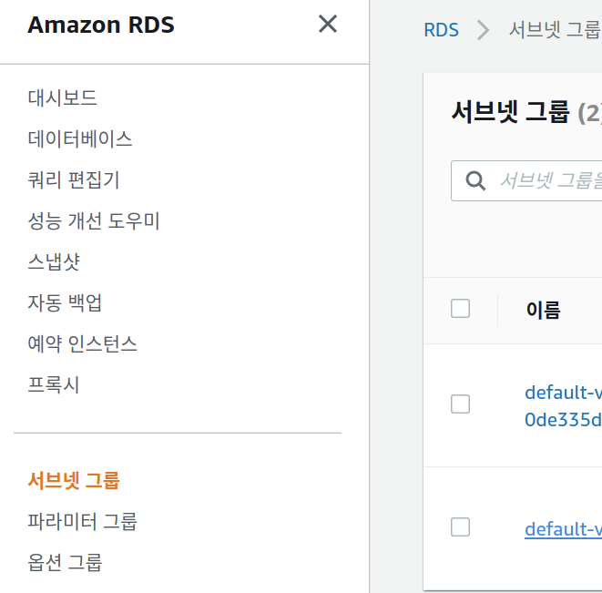

# AWS Note

## AWS Lambda
AWS Lambda는 이벤트에 응답하여 코드를 실행하고 자동으로 기본 컴퓨팅 리소스를 관리하는  서버없는 컴퓨팅 서비스이다.

- AWS 서비스와 관계가 적은 복잡한 기능을 수행해야 한다면 EC2 사용이 권장된다.
- AWS Lambda의 trigger로 AWS 서비스와 연계된 이벤트를 처리할 때 사용하거나,
    
    

- API서버 기능을 서버 없이 구현할 때 유용하다.
    - API 서버로는 AWS Gateway와 연계하여 설계하는 것이 더 효율적

- ex. HTTP API 서버 기능 / S3를 활용한 이미지 자동 처리 / SNS로 notification에 대한 자동 처리 / CloudWatch 특정 이벤트 발생에 대한 처리

- 배포에 대해 간소시킬 수 있어 코드를 lambda 콘솔에서 인라인으로 작성하거나, 패키지로 업로드하면 자동 배포된다.
- CloudWatch를 통해 각종 지표를 확인할 수 있다.
- 스케일링도 가능하여 대규모 트래픽 발생 시 빠르게 확장할 수 있다.
- 요청 수와 요청을 처리하는 함수 시간에 따라 요금이 발생하여 비용효율적이다.

### 게임 개발 예시
lambda는 보통 stateless 방식으로 백엔드를 구성하는데 최적화되어 있으며 서버의 백엔드를 REST API로 정의할 수 있다.


1. 서비리스 백엔드

- lambda가 main, gameStart, gameEnd 3가지 로직을 수행할 수 있도록 한다. API Gateway를 통해 API endpoint를 관리할 수 있다.
- lambda에서 VPC내의 RDS에 액세스할 수 있다. 
- 랭킹 대시보드를 만들거나 분산 환경에서 활용할 수 있는 비정형 데이터 워크로드를 처리하는데는 DynamoDB도 사용할 수 있다.

2. 처리 자동화
- 여러 서버의 로그를 Kinesis Data Firehose에 저장하고 해당 로그 포맷을 변환하는 함수를 호출할 수 있다.

3. 주기적인 작업


*(출처)*
- https://blog.algopie.com/aws/aws-lambda%EB%A5%BC-%EC%9D%B4%EC%9A%A9%ED%95%9C-api-%EC%84%9C%EB%B9%84%EC%8A%A4-%EB%B0%B0%ED%8F%AC-12/
- https://aws.amazon.com/ko/blogs/korea/using-aws-lambda-within-your-game/*

### 함수 생성
- lambda 함수를 만들 때 배포 패키지에 코드를 패키징하는데 컨테이너 이미지와 .zip 파일 아카이블 2가지를 지원한다. 
    - .zip 파일 아카이브로 기존 컨테이너 이미지 함수로 변환할 수 없다.

- AWS ECR에 컨테이너 이미지를 업로드하여 lambda에서 생성할 수 있다. 

*(출처)*
- https://docs.aws.amazon.com/ko_kr/lambda/latest/dg/lambda-functions.html
- https://docs.aws.amazon.com/ko_kr/lambda/latest/dg/gettingstarted-images.html

*(참고)*
- python 컨테이너 이미지 배포 : https://docs.aws.amazon.com/ko_kr/lambda/latest/dg/python-image.html
- 컨테이너 이미지로 함수 생성 : https://docs.aws.amazon.com/ko_kr/lambda/latest/dg/gettingstarted-images.html#gettingstarted-images-package

###  API Gateway 연동
API와 HTTP 엔드포인트를 생성할 수 있다.

*(참고) https://docs.aws.amazon.com/ko_kr/lambda/latest/dg/services-apigateway.html*


### Lambda 할당량

컴퓨팅 및 스토리지 리소스 할당량을 기본적으로 정해져있어 따로 설정해줘야 한다.



*(출처) https://docs.aws.amazon.com/ko_kr/lambda/latest/dg/gettingstarted-limits.html*

### 데이터 저장 옵션



*(출처) https://aws.amazon.com/ko/blogs/korea/choosing-between-aws-lambda-data-storage-options-in-web-apps/*

#### EFS 연동하기
- 같은 VPC 서브넷에 있어야 공유가 가능하다.
- 함수 구성의 [ 파일 시스템 추가 ] 에서 EFS를 선택한다.

*(출처) https://aws.amazon.com/ko/blogs/korea/new-a-shared-file-system-for-your-lambda-functions/*

VPC에 연결되면 인터넷에 엑세스하기 위한 권한이 부여되어야 한다.
- 프라이빗 서브넷에서 액세스하려면 NAT가 필요하다.
- 인터넷 액세스 권한을 부여하려면 아웃바운드 트래픽을 퍼블릭 서브넷의 NAT Gateway / NAT Instance로 라우팅해야 한다.

VPC 엔드포인트를 통하면 인터넷 게이트웨이, NAT 디바이스, VPN 연결 등이 필요없이 연결이 가능하다.

*(출처) https://aws.amazon.com/ko/premiumsupport/knowledge-center/internet-access-lambda-function/*

### VPC 연결 
lambda 서비스를 VPC에 연결하기 위해서는 실행 역할에 대해 다음 권한이 필요하다.

- ec2:CreateNetworkInterface
- ec2:DescribeNetworkInterfaces
- ec2:DeleteNetworkInterface 

이는 `AWSLambdaVPCAccessExecutionRole` 에 포함되어 있는데 정책을 연결해줘야 한다. 추가적으로 `AmazonElasticFileSystemClientReadWriteAccess` 권한이 필요하다.
[ 구성 ] - [ 권한 ] - [ 실행 역할 ] - [ ~역할 확인 ] 에서 역할을 편집하는데 `AWSLambdaVPCAccessExecutionRole` 권한을 선택하고 정책 연결을 선택한다.

DynamoDB 쿼리와 같이 수명이 짧은 작업을 할 경우 TCP 연결 대기에 대한 오버 헤드가 작업 자체보다 클 수 있다. 수명이 짧거나 자주 호출되지 않는 함수에 대한 연결을 재사용하려면 *TCP 연결 유지*를 사용하여 새 연결 생성을 방지한다.

### Lambda Python 패키지 이용하기
https://pearlluck.tistory.com/518

### 고정 IP 사용하기

- Elastic IP를 발급한다.
- 퍼블릭 및 프라이빗 서브넷이 있는 VPC에서 탄력적 IP를 할당한다.
- Lambda 설정을 변경한다.
    - AWSLambdaVPCAccessExecutionRole 권한을 추가한다.
    - **private 서브넷**을 선택하여 지정한다.
    - IP 테스트

*(출처) https://jetalog.net/91*

## 컨테이너 이미지로 lambda 함수 배포
보통 lambda용 AWS 기본 이미지를 이용하거나 커뮤니티, 프라이빗 이미지를 사용하느 경우 lambda와의 호환을 위해 [런타임 인터페이스 클라이언트](https://docs.aws.amazon.com/ko_kr/lambda/latest/dg/runtimes-images.html#runtimes-api-client)를 추가해야 한다.

*(출처) https://docs.aws.amazon.com/ko_kr/lambda/latest/dg/python-image.html*

AWS Lambda Runtime Interface Emulator(RIE)는 
- 로컬에서 컨테이너 이미지로 빌드한 lambda를 테스트할 수 있는 Lambda 런타임 API의 proxy이다.
- HTTP요청을 JSON 이벤트로 변환시켜 컨테이너 이미지의 lambda 함수에 전달하 경량 웹 서버이다.

Lambda용 AWS 기본 이미지에는 포함되어 있고 커뮤니티나 프라이빗 이미지를 사용하는 경우에도 빌드하여 테스트가 가능하다.

1. Lambda AWS 기본 이미지를 사용하면 `docker run -p 8000:8000 {function_name}:lastest .` 와 같이 테스트할 수 있다.
    `curl -XPOST "http://localhost:9000/2015-03-31/functions/{function_name}/invocations" -d '{}'` 와 같이 엔드포인트에 이벤트를 전송하여 반환되는 응답을 확인하여 테스트한다.
2. (이미지에 RIE 추가) 런타임 API가 있음을 확인하여 있으면 런타임 인터페이스 클라이언트를, 없으면 에뮬레이터를 실행한다.
```bash
#!/bin/sh
if [ -z "${AWS_LAMBDA_RUNTIME_API}" ]; then
  exec /usr/local/bin/aws-lambda-rie /usr/local/bin/python -m awslambdaric $@
else
  exec /usr/local/bin/python -m awslambdaric $@
fi     
```
    에뮬레이터 패키지를 다운받아 설치하고 Dockerfile을 수정한다. 

3. (이미지에 RIE 추가 없이 실행)

*(출처) https://docs.aws.amazon.com/ko_kr/lambda/latest/dg/images-test.html*

## [ AWS RDS 읽기 요청을 분산 참고 ]

AWS Route 53 기반으로 여러 읽기 전용 replica에 요청을 분산할 수 있다.
- Route 53 호스팅 영역 내에 읽기 전용 replica에 연결된 DNS 엔드포인트마다 개별 record를 생성하여 동일한 가중치가 부여됨
- record set의 엔드포인츠로 요청을 전달

1. RDS - 읽기 전용 replica 생성
2. Route 53 호스팅
3. record set 생성

*(출처) https://aws.amazon.com/ko/premiumsupport/knowledge-center/requests-rds-read-replicas/*

## AWS Web service

*(참고) https://www.slideshare.net/awskorea/ct-2015-your-10million-users-on-aws-channy*


## AWS Storage SSD vs. EBS
> SSD are faster because there's no network latency, but it is ephemeral and you can't detach it from an instance and attach it to another. As you can see, it is available to more powerful instances. 
EBS are more flexible, since you can attach and detach it from instances, but is a little bit slower, as more suitable for general purpose.

SSD는 좀 더 빠르게 사용할 수 있지만 인스턴스에 제한되고, EBS는 보다 유연하게 사용할 수 있지만( 다른 인스턴스에도 적용 가능 ) 네트워크를 타므로 느릴 수 있다.

*(출처) https://serverfault.com/questions/732196/ebs-vs-ssd-definition*


## [ AWS serverless를 통한 분산처리 참고 ]
*https://speakerdeck.com/microsoftware/masokon-2019-seobeoriseureul-hwalyonghan-bunsan-ceori-gimminjun?slide=78*

## AWS S3 vs. HDFS 
- S3는 더 cost-efficient하다. HDFS는 대용량 스토리지에 compute 스펙을 맞춰 인스턴스를 생성해야 하므로 보통 비용이 많이 나간다.
( S3의 경우 1TB 데이터에 보통 $23/월로 측정되고, HDFS는 전체 약 $103/월로 추정된다고 한다.)
- 보통 S3가 더 유연하고 multi-AZ가 가능하기에 availablity나 durability가 더 좋은 것으로 추정된다.
- HDFS가 데이터 지역성까지 좋으면 read throughput이 매우 뛰어나다.
- S3는 storage / compute를 분리해서 사용할 수 있어 cluster로 throughput을 증진시킬 수 있다. Spark와 같은 ETL job을 수행하면 된다.
- HDFS는 metadata 성능이 좋아 전체 files를 리스트업하는데 비교적 많이 빠르다.
- HDFS는 atomic특징이 있어 트랜젹션이 잘 보장된다.

*(출처) https://databricks.com/blog/2017/05/31/top-5-reasons-for-choosing-s3-over-hdfs.html*  
*(참고) https://resources.useready.com/blog/s3-vs-hdfs-comparing-technologies-in-the-big-data-ecosystem/*

## DB 인스턴스에 사용할 VPC 생성


DB 서브넷 그룹은 VPC에서 생성한 후 DB 인스턴스에 대해 지정하는 서브넷 모음이다. RDS에서 서브넷을 그룹의 해당 VPC에서 서브넷을 추가해야 작동된다.



*(출처) https://docs.aws.amazon.com/ko_kr/AmazonRDS/latest/UserGuide/CHAP_Tutorials.WebServerDB.CreateVPC.html*

## Aurora cluster 
>> Aurora Serverless DB 클러스터에는 공개적으로 액세스 가능한 엔드포인트가 없으므로 MyClusterName은 같은 VPC 내에서만 액세스할 수 있습니다.

## RDS SSL/TLS로 DB Cluster 연결 암호화
SSL( Secure Socket Layer ), TLS( Transport Layer Security  )을 사용하여 DB 클러스터에 대한 연결을 암호화할 수 있다.
SSL/TLS 연결은 클라이언트 - DB 클러스터 간에 전송되는 데이터를 암호화하여 하나의 보안 계층을 제공한다.

- 모든 인증서는 SSL/TLS 연결을 통한 다운로드로 사용 가능하다.
- AWS RDS Proxy, Aurora serverless 사용에서 AWS Certificate Manger(ACM)의 인증서를 사용한다. Aurora serverless의 경우 RDS 인증서를 다운로드할 필요는 없다.

기본적으로 Aurora Serverless는 TLS/SSL 프로토콜로 DB 클러스터 간 통신을 암호화한다.

클러스터 연결 상태를 통해 Aurora serverless에 대한 연결이 TLS/SSL로 암호화되었는지 확인할 수 있다.

- MySQL클라어인트에서 연결하려면 TLS/SSL을 지정해야 한다. [pem](https://www.amazontrust.com/repository/AmazonRootCA1.pem)을 다운받아 연결에 사용한다.
- Postgresql 클라이언트에서 설정해주지 않아도 된다. `psql -h endpoint -U user`와 같이 바로 연결할 수 있다.

*(출처)* 
- https://docs.aws.amazon.com/ko_kr/AmazonRDS/latest/AuroraUserGuide/UsingWithRDS.SSL.html
- https://docs.aws.amazon.com/AmazonRDS/latest/AuroraUserGuide/aurora-serverless.html#aurora-serverless.tls

## AWS EMR

AWS EMR의 중심 요소는 클러스터이다. 클러스터는 EC2 인스턴스의 모음인데 각 인스턴스를 노드라고 한다. 

노드 유형은 다음과 같다.
- Master Node : 클러스터를 관리하는 노드로 작업 상태를 추적하고 전체 클러스터 모니터링을 담당한다. 
- Core Node : 클러스터의 HDFS에서 작업을 실행하고 데이터를 저장하는 노드이다. 
- Worker Node : HDFS에서 데이터를 저장하진 않고 작업만 실행하는 노드이다.

보통 EMR에서 데이터를 처리할 때 INPUT은 Amazon S3나 HDFS같은 파일 시스템에 저장된 데이터이다. 처리 시퀀스에 따라 아래 단계에 따라 처리된다.  
  
1. 모든 단계는 PENDING으로 설정된다.
2. 시퀀스의 첫 번째 단계가 시작되면 RUNNING으로 바뀐다.
3. 첫 번째 단계가 완료되면 COMPLETED로 바뀐다.
4. 시퀀스의 다음 단계가 시작되고 2 -> 3이 진행된다.
5. 패턴이 반복된다.

### Architecture
**스토리지**
- HDFS : 데이터를 클러스터 인스턴스 전체에 분산하고 사본을 각기 다른 곳에 저장하여 장애 발생에도 유실되지 않도록 한다. 클러스터가 종료되면 사라지는 휘발성 스토리지이다. 
- EMRFS( EMR 파일 시스템 ) : HDFS 또는 S3 데이터를 클러스터의 파일 시스템으로 사용 가능하다. 보통은 S3에 INPUT, OUTPUT 데이터가 저장되면 중간 결과는 HDFS에 저장된다.  
- 로컬 파일 시스템 : 인스턴스 로컬로 연결된 디스크를 참조한다.

**클러스터 리소스 관리**
YARN을 통해 클러스터 리소스를 중앙에서 관리하기도 하고 안할 수도 있다.

**데이터 처리**
- Hadoop MapReduce : Map/Reduce 함수를 제공하여 병렬 분산 WRITE 프로세스를 간소화한다. Map 함수는 데이터를 Key-Value( 중간 결과 )에 매핑한다. Reduce 함수는 중간 결과를 집계하여 최종 결과를 산출한다. 
- Spark : 비순환 방향 그래프(DAG)를 사용하여 인메모리 캐시를 활용한다.

> https://docs.aws.amazon.com/ko_kr/emr/latest/ManagementGuide/emr-what-is-emr.html